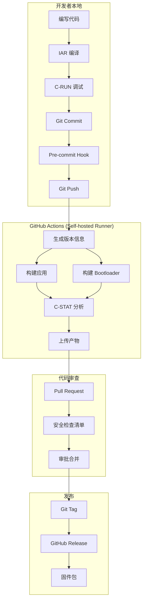
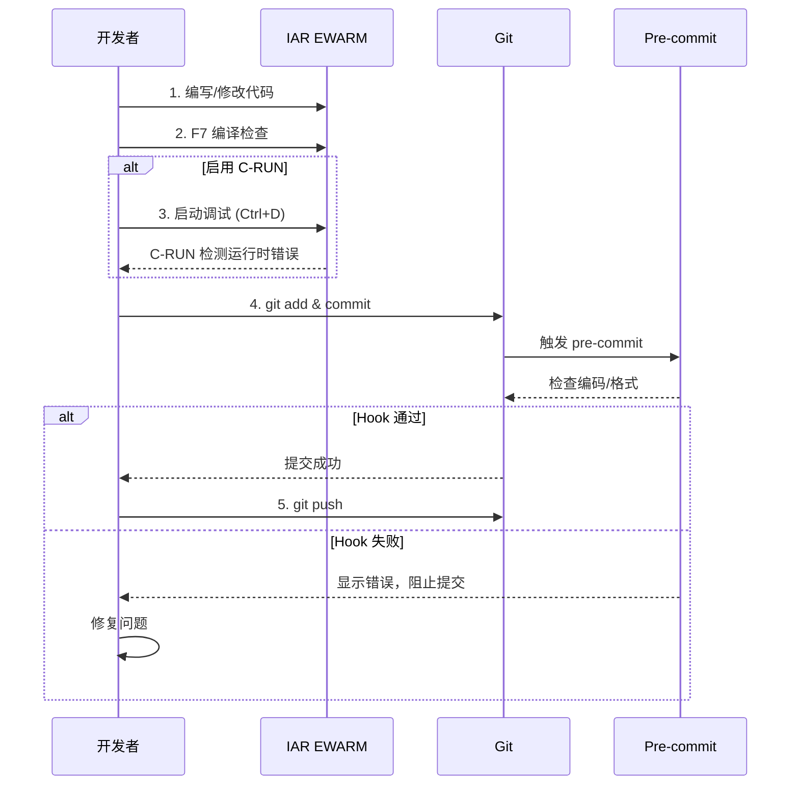
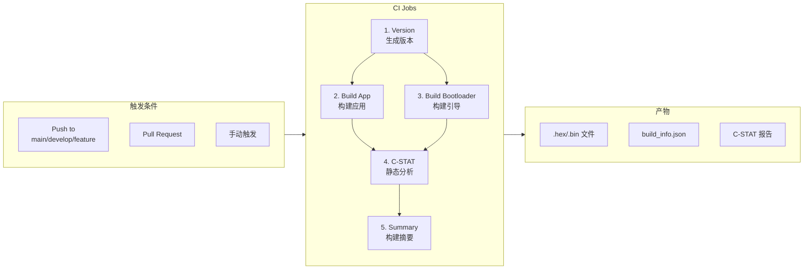
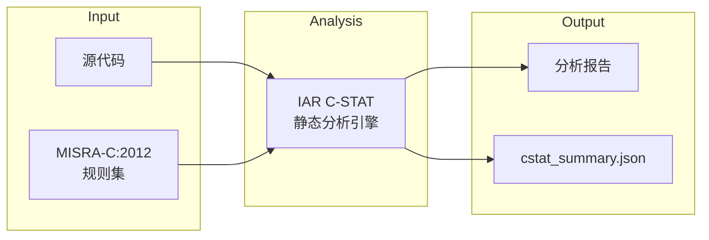
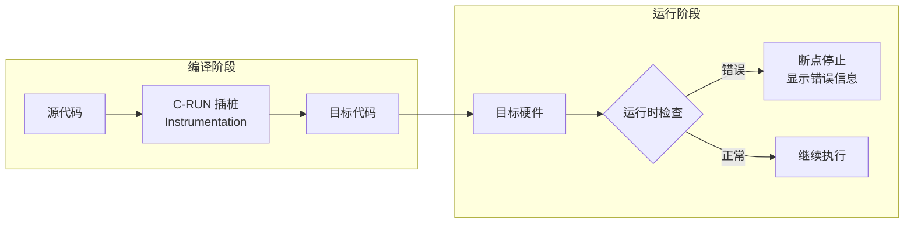
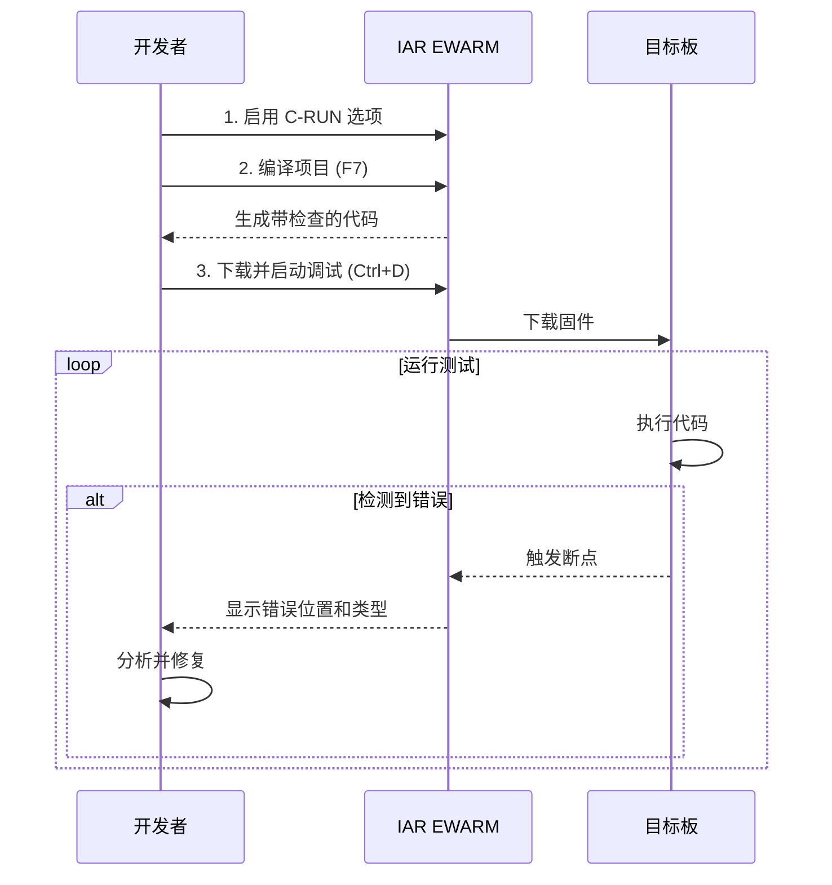
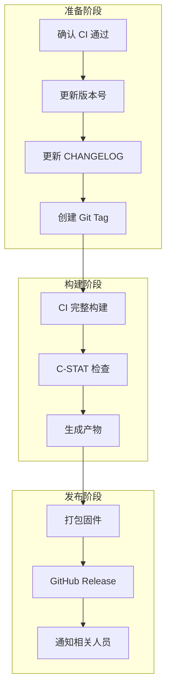

# CI/CD 工作流指南

**项目**: TKX_ThreadX
**合规标准**: IEC 61508 SIL 2 / ISO 13849 PL d / MISRA-C:2012
**版本**: 1.0.0

---

## 目录

1. [概述](#1-概述)
2. [工具链架构](#2-工具链架构)
3. [本地开发流程](#3-本地开发流程)
4. [CI/CD 流水线](#4-cicd-流水线)
5. [构建脚本使用](#5-构建脚本使用)
6. [静态分析](#6-静态分析)
7. [运行时分析](#7-运行时分析)
8. [版本管理](#8-版本管理)
9. [发布流程](#9-发布流程)

---

## 1. 概述

### 1.1 工作流架构图



### 1.2 工具链总览

| 工具 | 用途 | 执行时机 |
|------|------|----------|
| **IAR EWARM** | 编译构建 | 本地 + CI |
| **C-STAT** | MISRA-C 静态分析 | CI 自动 |
| **C-RUN** | 运行时错误检测 | 本地调试 |
| **GitHub Actions** | CI/CD 自动化 | Git Push |
| **Pre-commit Hook** | 代码风格检查 | Git Commit |

---

## 2. 工具链架构

### 2.1 目录结构

```
TKX_ThreadX/
├── .github/
│   ├── workflows/
│   │   └── ci-build.yml          # CI 工作流配置
│   └── PULL_REQUEST_TEMPLATE.md  # PR 安全检查清单
├── CI/
│   ├── scripts/
│   │   ├── build.ps1             # 主构建脚本
│   │   ├── build_bootloader.ps1  # Bootloader 构建
│   │   ├── build_crun.ps1        # C-RUN 构建
│   │   ├── cstat_analyze.ps1     # C-STAT 静态分析
│   │   └── generate_version.ps1  # 版本信息生成
│   └── hooks/
│       └── pre-commit            # Git pre-commit hook
├── Docs/
│   ├── CODING_STANDARD.md        # 编码规范
│   ├── SAFETY_CHECKLIST.md       # 安全检查清单
│   └── CI_CD_WORKFLOW.md         # 本文档
├── .editorconfig                 # 编辑器配置
├── .clang-format                 # 代码格式化配置
└── artifacts/                    # 构建产物 (gitignored)
    ├── TKX_ThreadX.hex
    ├── TKX_ThreadX.bin
    ├── build_info.json
    └── cstat/
        └── cstat_summary.json
```

### 2.2 IAR 工具路径

```
D:\iar\ewarm-9.70.1\
├── common\bin\
│   └── iarbuild.exe              # 命令行构建工具
├── arm\bin\
│   ├── iccarm.exe                # C 编译器
│   ├── ilinkarm.exe              # 链接器
│   └── ielftool.exe              # ELF 转换工具
└── arm\config\
    └── debugger\                 # 调试器配置
```

---

## 3. 本地开发流程

### 3.1 环境准备

```powershell
# 1. 安装 pre-commit hook
cp ci/hooks/pre-commit .git/hooks/
# Windows 下可能需要使用 Git Bash 执行

# 2. 验证 IAR 路径
D:\iar\ewarm-9.70.1\common\bin\iarbuild.exe
```

### 3.2 开发流程图



### 3.3 日常开发命令

```powershell
# 本地构建
.\ci\scripts\build.ps1 -Rebuild -GenerateHex -GenerateBin

# 仅编译检查
.\ci\scripts\build.ps1

# 构建 Bootloader
.\ci\scripts\build_bootloader.ps1 -Rebuild

# 本地运行 C-STAT
.\ci\scripts\cstat_analyze.ps1

# 生成版本信息
.\ci\scripts\generate_version.ps1
```

---

## 4. CI/CD 流水线

### 4.1 流水线架构



### 4.2 GitHub Actions 配置

**文件位置**: `.github/workflows/ci-build.yml`

```yaml
# 触发条件
on:
  push:
    branches: [main, develop, 'feature/**']
  pull_request:
    branches: [main, develop]
  workflow_dispatch:  # 手动触发

# 运行环境
runs-on: [self-hosted, Windows, IAR]

# 主要 Jobs
jobs:
  version:        # 生成版本信息
  build-app:      # 构建主应用
  build-bootloader: # 构建 Bootloader
  static-analysis:  # C-STAT 分析
  summary:        # 构建摘要
```

### 4.3 Self-hosted Runner 配置

**要求**:
- Windows 10/11 或 Windows Server
- IAR EWARM 9.70.1 (D:\iar\ewarm-9.70.1)
- IAR 许可证 (PC-locked)
- Git for Windows

**安装步骤**:
```powershell
# 1. 从 GitHub 仓库设置页面获取 Runner 安装包
# Settings → Actions → Runners → New self-hosted runner

# 2. 下载并解压到 C:\actions-runner

# 3. 配置 Runner
.\config.cmd --url https://github.com/YOUR_ORG/TKX_ThreadX `
             --token YOUR_TOKEN `
             --labels "self-hosted,Windows,IAR"

# 4. 安装为 Windows 服务
.\svc.sh install
.\svc.sh start
```

---

## 5. 构建脚本使用

### 5.1 build.ps1 - 主构建脚本

```powershell
# 语法
.\ci\scripts\build.ps1 [参数]

# 参数
-Configuration    # 构建配置名 (默认: TKX_ThreadX)
-IARPath          # IAR 安装路径 (默认: D:\iar\ewarm-9.70.1)
-ProjectPath      # 项目文件路径
-Clean            # 清理构建
-Rebuild          # 完全重新构建
-GenerateHex      # 生成 HEX 文件
-GenerateBin      # 生成 BIN 文件
-Verbose          # 详细输出
```

**示例**:
```powershell
# 完整重建并生成输出文件
.\ci\scripts\build.ps1 -Rebuild -GenerateHex -GenerateBin

# 仅清理
.\ci\scripts\build.ps1 -Clean

# 增量构建
.\ci\scripts\build.ps1

# 指定项目
.\ci\scripts\build.ps1 -ProjectPath "C:\Projects\MyProject.ewp"
```

### 5.2 build_bootloader.ps1 - Bootloader 构建

```powershell
# 语法
.\ci\scripts\build_bootloader.ps1 [参数]

# 示例
.\ci\scripts\build_bootloader.ps1 -Rebuild
```

### 5.3 build_crun.ps1 - C-RUN 构建

```powershell
# 语法
.\ci\scripts\build_crun.ps1 [参数]

# 说明
# 构建启用 C-RUN 运行时检查的版本
# 需要在 IAR 项目选项中启用 C-RUN 检查项
```

---

## 6. 静态分析

### 6.1 C-STAT 概述



### 6.2 cstat_analyze.ps1 使用

```powershell
# 语法
.\ci\scripts\cstat_analyze.ps1 [参数]

# 参数
-Configuration    # 构建配置名
-IARPath          # IAR 安装路径
-ProjectPath      # 项目文件路径
-OutputFormat     # 输出格式 (html, xml, txt)
-FailOnHigh       # 高严重度问题时失败
-FailOnMedium     # 中严重度问题时失败

# 示例
.\ci\scripts\cstat_analyze.ps1 -FailOnHigh
```

### 6.3 排除路径

以下第三方代码不进行 MISRA 检查：
```
Middlewares/ST/threadx/*
Middlewares/ST/filex/*
Drivers/CMSIS/*
ThirdParty/SEGGER/*
```

### 6.4 C-STAT 报告解读

| 严重度 | 处理 |
|--------|------|
| **High** | 必须修复 |
| **Medium** | 应该修复 |
| **Low** | 建议修复 |

**输出文件**:
- `artifacts/cstat/C-STAT_Messages_Filtered.txt` - 过滤后的报告
- `artifacts/cstat/cstat_summary.json` - JSON 摘要

---

## 7. 运行时分析

### 7.1 C-RUN 概述

C-RUN 在**目标硬件调试时**检测运行时错误：



### 7.2 C-RUN 配置

**位置**: Project → Options → C/C++ Compiler → Runtime Checking

| 检查项 | 说明 |
|--------|------|
| ☑ Bounds checking | 数组越界检测 |
| ☑ Integer overflow | 有符号整数溢出 |
| ☑ Unsigned overflow | 无符号整数溢出 |
| ☑ Shift overflow | 移位操作溢出 |
| ☑ Division by zero | 除零检测 |
| ☑ Unhandled case | switch 未处理 case |

### 7.3 C-RUN 使用流程



---

## 8. 版本管理

### 8.1 版本信息生成

```powershell
# 生成版本头文件
.\ci\scripts\generate_version.ps1

# 指定版本号
.\ci\scripts\generate_version.ps1 -MajorVersion 1 -MinorVersion 2 -PatchVersion 0
```

### 8.2 生成的版本信息

**文件**: `Core/Inc/version_info.h`

```c
#define VERSION_MAJOR           1
#define VERSION_MINOR           0
#define VERSION_PATCH           0
#define VERSION_BUILD           2412101530

#define GIT_COMMIT              "abc1234"
#define GIT_BRANCH              "main"
#define GIT_TAG                 "v1.0.0"
#define GIT_DIRTY               0

#define BUILD_DATE              "2025-12-10"
#define BUILD_TIMESTAMP         "2025-12-10T15:30:00Z"

#define VERSION_STRING          "1.0.0"
#define VERSION_FULL            "1.0.0+2512101530"
```

### 8.3 构建信息 JSON

**文件**: `artifacts/build_info.json`

```json
{
  "project": "TKX_ThreadX",
  "version": "1.0.0",
  "build_number": "2512101530",
  "timestamp": "2025-12-10T15:30:00Z",
  "git": {
    "commit": "abc1234",
    "branch": "main",
    "tag": "v1.0.0",
    "dirty": false
  },
  "toolchain": {
    "iar_version": "9.70.1"
  }
}
```

---

## 9. 发布流程

### 9.1 发布流程图



### 9.2 发布检查清单

```markdown
## 发布前检查

### 代码质量
- [ ] 所有 CI 检查通过
- [ ] C-STAT 无高严重度问题
- [ ] 代码审查已完成

### 测试
- [ ] C-RUN 运行时测试通过
- [ ] 功能测试通过
- [ ] 安全自检通过

### 文档
- [ ] CHANGELOG 已更新
- [ ] 版本号已更新
- [ ] 发布说明已准备

### 产物
- [ ] TKX_ThreadX.hex 已生成
- [ ] TKX_ThreadX.bin 已生成
- [ ] Bootloader.hex 已生成
- [ ] build_info.json 已生成
```

### 9.3 创建发布

```bash
# 1. 确保在 main 分支
git checkout main
git pull

# 2. 创建并推送 tag
git tag -a v1.0.0 -m "Release v1.0.0"
git push origin v1.0.0

# 3. GitHub Actions 自动触发发布构建
# 或手动触发 release workflow
```

### 9.4 发布产物结构

```
TKX_ThreadX-v1.0.0/
├── TKX_ThreadX.hex          # 主应用程序 (Intel HEX)
├── TKX_ThreadX.bin          # 主应用程序 (Binary)
├── Bootloader.hex           # Bootloader (Intel HEX)
├── Bootloader.bin           # Bootloader (Binary)
├── build_info.json          # 构建信息
├── cstat_summary.json       # C-STAT 分析摘要
└── RELEASE_NOTES.md         # 发布说明
```

---

## 附录 A: 故障排除

### A.1 常见问题

| 问题 | 解决方案 |
|------|----------|
| iarbuild.exe 未找到 | 检查 IAR_PATH 环境变量 |
| 许可证错误 | 确认在有许可证的机器上运行 |
| CI 构建失败 | 检查 Self-hosted Runner 状态 |
| C-STAT 报告为空 | 确认项目已编译成功 |

### A.2 日志位置

```
artifacts/
├── build_stdout.log         # 构建输出
├── build_stderr.log         # 构建错误
└── cstat/
    ├── C-STAT_Messages_Full.txt     # 完整报告
    └── C-STAT_Messages_Filtered.txt # 过滤报告
```

---

## 版本历史

| 版本 | 日期 | 描述 |
|------|------|------|
| 1.0.0 | 2025-12-10 | 初始版本 |
