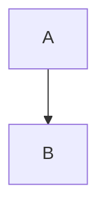
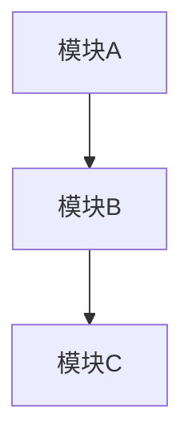

# 文档编写规范

**项目**: TKX_ThreadX
**版本**: 1.0.0

---

## 1. 文档结构

### 1.1 文件头部

所有文档必须以标准头部开始：

```markdown
# 文档标题

**项目**: TKX_ThreadX
**版本**: x.x.x

---
```

### 1.2 目录结构

长文档（超过 200 行）应包含目录：

```markdown
## 目录

1. [章节一](#1-章节一)
2. [章节二](#2-章节二)
   - [子章节](#21-子章节)
```

### 1.3 版本历史

文档末尾应包含版本历史（可选）：

```markdown
## 版本历史

| 版本 | 日期 | 描述 |
|------|------|------|
| 1.0.0 | 2025-12-10 | 初始版本 |
```

---

## 2. 标题规范

### 2.1 层级使用

| 层级 | 用途 | 示例 |
|------|------|------|
| `#` | 文档标题（仅一个） | `# 架构设计` |
| `##` | 主要章节 | `## 1. 系统概述` |
| `###` | 子章节 | `### 1.1 硬件架构` |
| `####` | 细分内容 | `#### API 参数` |

### 2.2 编号规则

- 主章节使用数字编号：`## 1. 章节名`
- 子章节使用小数点分隔：`### 1.1 子章节名`
- 非结构化章节可不编号

---

## 3. 代码块规范

### 3.1 语言标识

始终指定代码语言：

````markdown
```c
// C 代码
int main(void) { return 0; }
```


````

### 3.2 代码注释

代码示例应包含必要注释：

```c
/* 初始化安全模块 */
Safety_Init();

/* 检查返回值 */
if (status != STATUS_OK)
{
    /* 错误处理 */
}
```

---

## 4. 图表规范

### 4.1 Mermaid 图表

优先使用 Mermaid 绘制图表：



**支持的图表类型**：

| 类型 | 用途 |
|------|------|
| `graph TB/LR` | 流程图、架构图 |
| `sequenceDiagram` | 时序图 |
| `stateDiagram-v2` | 状态机 |
| `flowchart` | 流程图 |
| `pie` | 饼图 |

### 4.2 图表样式

- 使用中文标签
- 关键节点添加颜色：`style NODE fill:#f96`
- 分组使用 `subgraph`

---

## 5. 表格规范

### 5.1 基本格式

```markdown
| 列1 | 列2 | 列3 |
|-----|-----|-----|
| 值1 | 值2 | 值3 |
```

### 5.2 对齐方式

- 默认左对齐
- 数字列可右对齐：`|---:|`
- 标题居中对齐：`|:---:|`

---

## 6. 链接规范

### 6.1 文档内链接

```markdown
详见 [章节名](#章节锚点)
```

### 6.2 文档间链接

```markdown
详见 [架构设计](ARCHITECTURE.md)
详见 [架构设计 - 内存布局](ARCHITECTURE.md#3-内存布局详解)
```

### 6.3 外部链接

```markdown
参考 [ThreadX 文档](https://docs.microsoft.com/azure/rtos/threadx/)
```

---

## 7. 术语与缩写

### 7.1 首次出现

首次使用缩写时应给出全称：

```markdown
MPU（内存保护单元，Memory Protection Unit）
```

### 7.2 常用缩写表

| 缩写 | 全称 | 中文 |
|------|------|------|
| MCU | Microcontroller Unit | 微控制器 |
| MPU | Memory Protection Unit | 内存保护单元 |
| RTOS | Real-Time Operating System | 实时操作系统 |
| CRC | Cyclic Redundancy Check | 循环冗余校验 |
| HAL | Hardware Abstraction Layer | 硬件抽象层 |
| BSP | Board Support Package | 板级支持包 |
| IWDG | Independent Watchdog | 独立看门狗 |
| WWDG | Window Watchdog | 窗口看门狗 |
| SIL | Safety Integrity Level | 安全完整性等级 |
| PL | Performance Level | 性能等级 |

---

## 8. 命名规范

### 8.1 目录命名

- 使用首字母大写（PascalCase）
- 示例：`Docs/`, `CI/`, `App/`, `Safety/`

### 8.2 文档文件命名

- 使用全大写字母和下划线
- 扩展名小写 `.md`
- 示例：`ARCHITECTURE.md`, `CODING_STANDARD.md`

### 8.3 代码文件命名

- 使用小写字母和下划线（snake_case）
- 示例：`safety_core.c`, `app_main.h`

---

## 9. 语言规范

### 9.1 双语支持

重要术语可使用双语格式：

```markdown
## 系统概述 / System Overview
```

### 9.2 技术准确性

- 不做无依据的合规性声明
- 数值需标明单位
- 地址使用十六进制：`0x08000000`

---

## 10. 文档清单

| 文档 | 文件名 | 说明 |
|------|--------|------|
| 项目说明 | README.md | 项目概述、快速开始 |
| 架构设计 | ARCHITECTURE.md | 系统架构、设计决策 |
| 引导程序 | BOOTLOADER.md | 引导程序设计 |
| 安全模块 | SAFETY_MODULES.md | 安全模块 API |
| 服务层 | SERVICES.md | 服务层接口 |
| 应用层 | APP_LAYER.md | 应用开发指南 |
| 编码规范 | CODING_STANDARD.md | C 代码规范 |
| 持续集成 | CI_CD_WORKFLOW.md | 自动化构建 |
| 安全检查 | SAFETY_CHECKLIST.md | 发布检查清单 |
| 文档规范 | DOC_STYLE_GUIDE.md | 本文档 |
