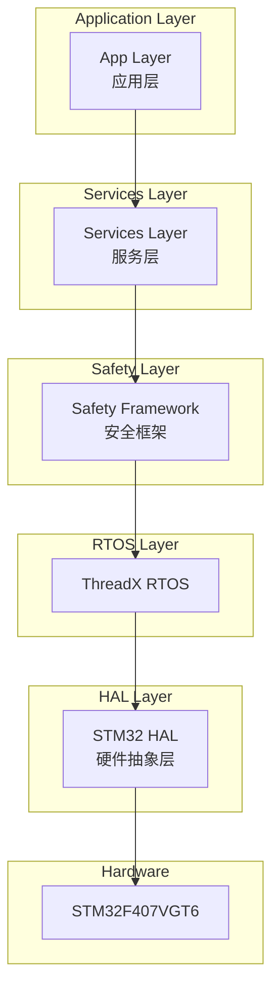
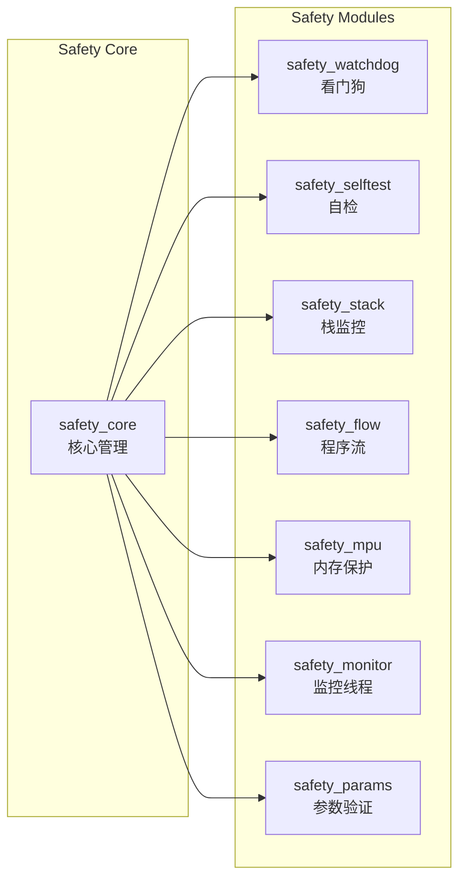
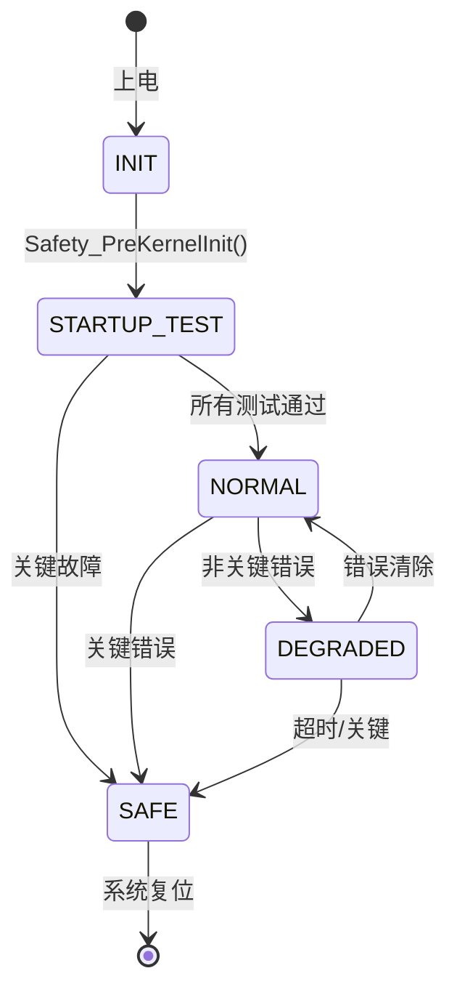
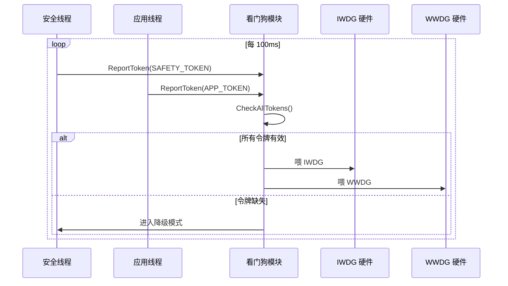

# 功能安全检查清单

**项目**: TKX_ThreadX
**合规标准**: IEC 61508 SIL 2 / ISO 13849 PL d
**版本**: 1.0.0

---

## 目录

1. [系统架构图](#1-系统架构图)
2. [设计阶段检查](#2-设计阶段检查)
3. [编码阶段检查](#3-编码阶段检查)
4. [测试阶段检查](#4-测试阶段检查)
5. [代码审查要点](#5-代码审查要点)
6. [MISRA-C 合规](#6-misra-c-合规)
7. [发布检查](#7-发布检查)

---

## 1. 系统架构图

### 1.1 系统层次结构



### 1.2 安全模块架构



### 1.3 安全状态机



### 1.4 看门狗令牌机制



---

## 2. 设计阶段检查

### 2.1 架构设计

| 检查项 | 要求 | 状态 |
|--------|------|------|
| 分层架构 | 系统使用清晰的分层架构 | ☐ |
| 模块独立性 | 模块间低耦合 | ☐ |
| 错误传播 | 错误不应跨层传播 | ☐ |
| 安全隔离 | 安全功能与非安全功能隔离 | ☐ |
| 内存保护 | 使用 MPU 保护关键区域 | ☐ |

### 2.2 安全分析

| 检查项 | 要求 | 状态 |
|--------|------|------|
| FMEA 分析 | 完成失效模式分析 | ☐ |
| 诊断覆盖率 | DC ≥ 90% (运行时) | ☐ |
| 共因失效 | 识别并缓解共因失效 | ☐ |
| 安全功能 | 所有安全功能已识别 | ☐ |

---

## 3. 编码阶段检查

### 3.1 编码规范

| 检查项 | 要求 | 状态 |
|--------|------|------|
| 命名规范 | 遵循 CODING_STANDARD.md | ☐ |
| Doxygen 注释 | 所有公共函数有文档 | ☐ |
| 头文件格式 | 使用标准模板 | ☐ |
| 类型安全 | 使用 stdint.h 类型 | ☐ |
| 常量后缀 | 数字常量有 U/UL 后缀 | ☐ |

### 3.2 防御性编程

| 检查项 | 要求 | 状态 |
|--------|------|------|
| 输入验证 | 所有外部输入已验证 | ☐ |
| 空指针检查 | 检查所有指针参数 | ☐ |
| 边界检查 | 数组访问有边界检查 | ☐ |
| 返回值检查 | 检查所有函数返回值 | ☐ |
| 初始化 | 所有变量已初始化 | ☐ |

### 3.3 安全机制

| 检查项 | 要求 | 状态 |
|--------|------|------|
| 看门狗喂狗 | 正确报告令牌 | ☐ |
| 栈监控 | 线程已注册栈监控 | ☐ |
| 程序流 | 使用检查点 | ☐ |
| 错误处理 | 错误正确报告 | ☐ |
| 安全状态 | 可进入安全状态 | ☐ |

---

## 4. 测试阶段检查

### 4.1 单元测试

| 检查项 | 要求 | 状态 |
|--------|------|------|
| 测试覆盖率 | 代码覆盖率 ≥ 80% | ☐ |
| 边界测试 | 测试边界条件 | ☐ |
| 错误路径 | 测试错误处理路径 | ☐ |
| Mock 使用 | 硬件依赖已 Mock | ☐ |

### 4.2 集成测试

| 检查项 | 要求 | 状态 |
|--------|------|------|
| 接口测试 | 模块接口已测试 | ☐ |
| 状态转换 | 状态机转换已验证 | ☐ |
| 时序测试 | 时序要求已验证 | ☐ |
| 负载测试 | 在负载下测试 | ☐ |

### 4.3 安全测试

| 检查项 | 要求 | 状态 |
|--------|------|------|
| 故障注入 | 进行故障注入测试 | ☐ |
| 看门狗测试 | 看门狗超时已验证 | ☐ |
| 自检验证 | 所有自检已验证 | ☐ |
| 安全状态测试 | 安全状态可达 | ☐ |
| 恢复测试 | 错误恢复已测试 | ☐ |

---

## 5. 代码审查要点

### 5.1 必查项目

```markdown
## 代码审查清单

### 安全相关
- [ ] 无动态内存分配
- [ ] 无无限循环无退出
- [ ] 所有函数有返回值检查
- [ ] 关键数据有冗余
- [ ] 状态机转换有效性检查

### 代码质量
- [ ] 符合 CODING_STANDARD.md
- [ ] 有意义的命名
- [ ] 适当的注释
- [ ] 无魔法数字
- [ ] 无代码重复

### MISRA-C 合规
- [ ] 无新增高严重度问题
- [ ] 中严重度问题已评审
- [ ] 偏差有文档记录
```

### 5.2 审查问题分类

| 严重度 | 描述 | 处理 |
|--------|------|------|
| **严重** | 安全问题、数据损坏风险 | 必须修复后合并 |
| **重要** | 功能缺陷、MISRA 高违规 | 应修复后合并 |
| **次要** | 代码风格、可读性 | 可在后续修复 |
| **信息** | 建议、优化 | 可选修复 |

---

## 6. MISRA-C 合规

### 6.1 C-STAT 分析配置

```
排除路径:
- Middlewares/ST/*        (ThreadX, FileX)
- Drivers/CMSIS/*         (ARM CMSIS)
- ThirdParty/*            (Segger RTT/SystemView)

检查范围:
- Safety/*                (安全模块)
- App/*                   (应用程序)
- Services/*              (服务层)
- BSP/*                   (板级支持包)
- Shared/*                (共享代码)
```

### 6.2 合规目标

| 规则类别 | 目标 |
|----------|------|
| Mandatory 规则 | 100% 合规 |
| Required 规则 | ≥ 95% 合规 |
| Advisory 规则 | ≥ 80% 合规 |
| 高严重度问题 | 0 个 |
| 中严重度问题 | 有文档记录 |

---

## 7. 发布检查

### 7.1 发布前检查清单

| 检查项 | 要求 | 状态 |
|--------|------|------|
| CI 构建通过 | 所有 CI 检查通过 | ☐ |
| 测试报告 | 所有测试通过 | ☐ |
| C-STAT 报告 | 无高严重度问题 | ☐ |
| 代码审查 | 所有代码已审查 | ☐ |
| 文档更新 | 文档与代码同步 | ☐ |
| 版本号更新 | 版本号已更新 | ☐ |
| 变更日志 | CHANGELOG 已更新 | ☐ |

### 7.2 发布产物

```
TKX_ThreadX-vX.Y.Z/
├── TKX_ThreadX.hex          # 主应用程序
├── TKX_ThreadX.bin          # 主应用程序（二进制）
├── Bootloader.hex           # Bootloader
├── Bootloader.bin           # Bootloader（二进制）
├── build_info.json          # 构建信息
├── cstat_summary.json       # C-STAT 摘要
├── RELEASE_NOTES.md         # 发布说明
└── test_report.xml          # 测试报告
```

---

## 版本历史

| 版本 | 日期 | 描述 |
|------|------|------|
| 1.0.0 | 2025-12-10 | 初始版本 |
