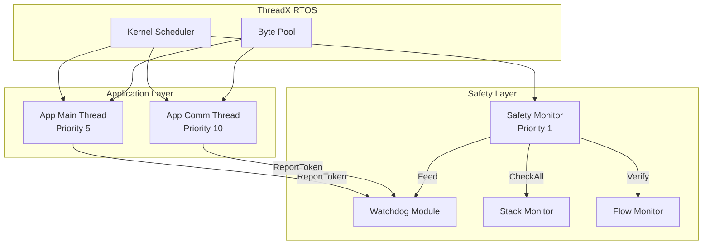
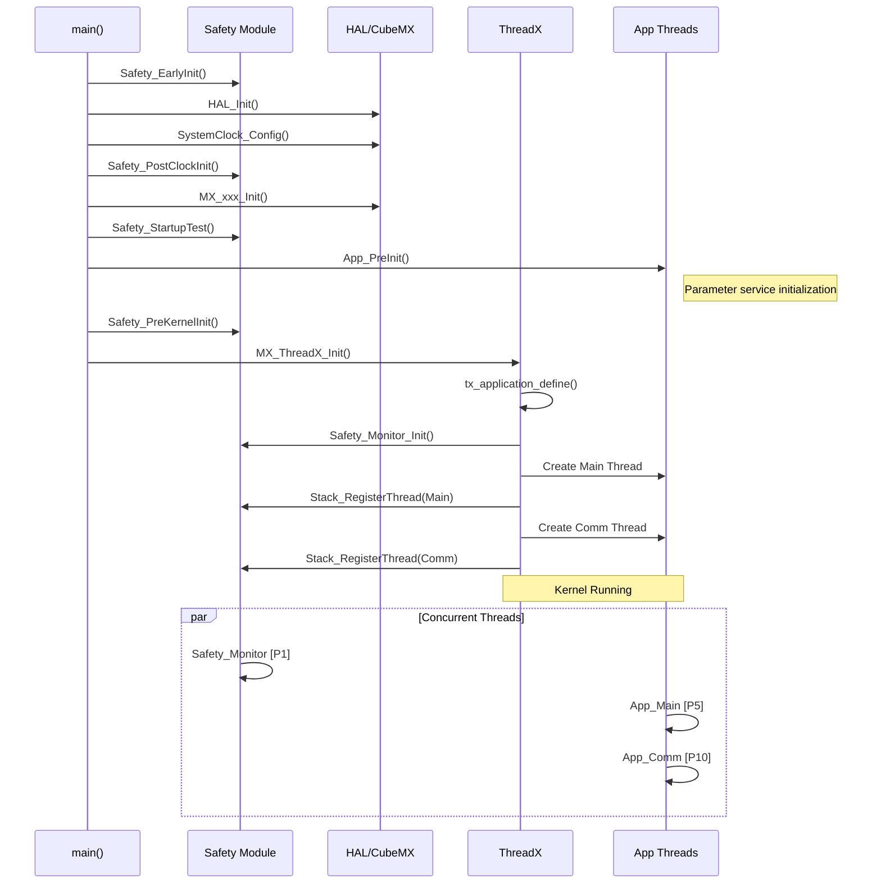

# Application Layer Documentation

**Project**: TKX_ThreadX
**Version**: 1.0.1
**Module**: Application Layer

---

## Overview

The application layer is the top layer of the functional safety framework, containing business logic implementation. Application layer threads run under the protection of the safety framework.

### Application Layer Architecture



## File Structure

```
App/
├── Inc/
│   └── app_main.h      # Application layer interface
└── Src/
    └── app_main.c      # Application layer implementation
```

## Thread Configuration

| Thread | Stack Size | Priority | Description |
|--------|-----------|----------|-------------|
| App Main | 4KB | 5 | Main business logic |
| App Comm | 2KB | 10 | Communication handling |

### Configuration Definitions

```c
#define APP_MAIN_THREAD_STACK_SIZE      4096U
#define APP_MAIN_THREAD_PRIORITY        5U
#define APP_MAIN_THREAD_PREEMPT_THRESH  5U

#define APP_COMM_THREAD_STACK_SIZE      2048U
#define APP_COMM_THREAD_PRIORITY        10U
#define APP_COMM_THREAD_PREEMPT_THRESH  10U
```

## API Reference

### App_PreInit

```c
shared_status_t App_PreInit(void);
```

Initialization before ThreadX startup, mainly initializes parameter service.

**Call Location**: Before `MX_ThreadX_Init()` in `main()`

### App_CreateThreads

```c
UINT App_CreateThreads(TX_BYTE_POOL *byte_pool);
```

Creates application layer threads.

**Parameters**:
- `byte_pool` - ThreadX byte pool for thread stack allocation

**Call Location**: In `tx_application_define()`

**Execution Flow**:
1. Create Safety Monitor thread
2. Allocate Main thread stack
3. Create Main thread
4. Register Main thread stack monitoring
5. Allocate Comm thread stack
6. Create Comm thread
7. Register Comm thread stack monitoring

### App_MainThreadEntry

```c
void App_MainThreadEntry(ULONG thread_input);
```

Main application thread entry function.

**Execution Content**:
- Wait for safety system ready
- Execute main business logic
- Report watchdog token
- Record program flow checkpoints

### App_CommThreadEntry

```c
void App_CommThreadEntry(ULONG thread_input);
```

Communication thread entry function.

**Execution Content**:
- Wait for safety system ready
- Handle communication
- Report watchdog token
- Record program flow checkpoints

### App_GetMainThread / App_GetCommThread

```c
TX_THREAD* App_GetMainThread(void);
TX_THREAD* App_GetCommThread(void);
```

Get thread handles.

## Application Thread Template

### Main Thread Example

```c
void App_MainThreadEntry(ULONG thread_input)
{
    (void)thread_input;

    /* Wait for safety system ready */
    while (!Safety_IsOperational())
    {
        tx_thread_sleep(10);
    }

    /* Main loop */
    while (1)
    {
        /* Check safety state */
        safety_state_t state = Safety_GetState();

        if (state == SAFETY_STATE_NORMAL)
        {
            /* ======================================
             * Normal Operation - Add Business Logic
             * ====================================== */

            /* Example: Read sensors */
            ReadSensors();

            /* Example: Process data */
            ProcessData();

            /* Example: Control outputs */
            UpdateOutputs();

            /* Record program flow checkpoint */
            Safety_Flow_Checkpoint(PFM_CP_APP_MAIN_LOOP);

            /* Report watchdog token */
            Safety_Watchdog_ReportToken(WDG_TOKEN_MAIN_THREAD);
        }
        else if (state == SAFETY_STATE_DEGRADED)
        {
            /* ======================================
             * Degraded Operation - Limited Functionality
             * ====================================== */

            /* Example: Only read sensors, no control outputs */
            ReadSensors();

            /* Still need to report token */
            Safety_Watchdog_ReportToken(WDG_TOKEN_MAIN_THREAD);
        }
        else
        {
            /* Safe stop or error state - No operation */
        }

        /* Thread sleep */
        tx_thread_sleep(10);  /* 10ms period */
    }
}
```

### Communication Thread Example

```c
void App_CommThreadEntry(ULONG thread_input)
{
    (void)thread_input;

    /* Wait for safety system ready */
    while (!Safety_IsOperational())
    {
        tx_thread_sleep(10);
    }

    /* Communication loop */
    while (1)
    {
        safety_state_t state = Safety_GetState();

        if (state == SAFETY_STATE_NORMAL || state == SAFETY_STATE_DEGRADED)
        {
            /* ======================================
             * Communication Handling
             * ====================================== */

            /* Example: Check CAN messages */
            if (CAN_MessageAvailable())
            {
                ProcessCANMessage();
            }

            /* Example: Send status */
            SendStatusMessage();

            /* Record checkpoint */
            Safety_Flow_Checkpoint(PFM_CP_APP_COMM_HANDLER);

            /* Report token */
            Safety_Watchdog_ReportToken(WDG_TOKEN_COMM_THREAD);
        }

        /* Event-driven sleep */
        tx_thread_sleep(100);
    }
}
```

## Adding New Threads

### Steps

1. **Define Thread Configuration**

```c
/* app_main.h */
#define APP_NEW_THREAD_STACK_SIZE      2048U
#define APP_NEW_THREAD_PRIORITY        8U
#define APP_NEW_THREAD_PREEMPT_THRESH  8U
```

2. **Add Thread Variables**

```c
/* app_main.c */
static TX_THREAD s_new_thread;
static UCHAR *s_new_stack = NULL;
```

3. **Create Thread**

```c
/* In App_CreateThreads() */
status = tx_byte_allocate(byte_pool,
                          (VOID **)&s_new_stack,
                          APP_NEW_THREAD_STACK_SIZE,
                          TX_NO_WAIT);
if (status != TX_SUCCESS) return status;

status = tx_thread_create(&s_new_thread,
                          "App New",
                          App_NewThreadEntry,
                          0,
                          s_new_stack,
                          APP_NEW_THREAD_STACK_SIZE,
                          APP_NEW_THREAD_PRIORITY,
                          APP_NEW_THREAD_PREEMPT_THRESH,
                          TX_NO_TIME_SLICE,
                          TX_AUTO_START);
if (status != TX_SUCCESS) return status;

/* Register stack monitoring */
Safety_Stack_RegisterThread(&s_new_thread);
```

4. **Define Watchdog Token** (if needed)

```c
/* safety_config.h */
#define WDG_TOKEN_NEW_THREAD    0x08U
#define WDG_TOKEN_ALL           (WDG_TOKEN_SAFETY_THREAD | \
                                 WDG_TOKEN_MAIN_THREAD | \
                                 WDG_TOKEN_COMM_THREAD | \
                                 WDG_TOKEN_NEW_THREAD)
```

5. **Implement Thread Entry**

```c
void App_NewThreadEntry(ULONG thread_input)
{
    (void)thread_input;

    while (!Safety_IsOperational())
    {
        tx_thread_sleep(10);
    }

    while (1)
    {
        if (Safety_GetState() == SAFETY_STATE_NORMAL)
        {
            /* Business logic */
            DoWork();

            /* Report token (if registered) */
            Safety_Watchdog_ReportToken(WDG_TOKEN_NEW_THREAD);
        }

        tx_thread_sleep(50);
    }
}
```

## Interacting with Safety Modules

### Check Safety State

```c
/* Get current state */
safety_state_t state = Safety_GetState();

switch (state)
{
    case SAFETY_STATE_NORMAL:
        /* Normal operation */
        break;

    case SAFETY_STATE_DEGRADED:
        /* Degraded operation */
        break;

    case SAFETY_STATE_SAFE:
    case SAFETY_STATE_ERROR:
        /* Stop operation */
        break;

    default:
        break;
}

/* Check if operational */
if (Safety_IsOperational())
{
    /* Can execute operations */
}
```

### Report Errors

```c
/* Report when anomaly detected */
if (sensor_value > MAX_SAFE_VALUE)
{
    Safety_ReportError(SAFETY_ERR_INTERNAL,
                       (uint32_t)sensor_value,
                       MAX_SAFE_VALUE);
}
```

### Using Parameter Service

```c
/* Check parameter validity */
if (Svc_Params_IsValid())
{
    /* Get calibration parameters */
    float gain = Svc_Params_GetHallGain(0);
    float offset = Svc_Params_GetHallOffset(0);

    /* Apply calibration */
    calibrated = (raw - offset) * gain;
}
else
{
    /* Use default value or reject processing */
    calibrated = raw;
}
```

## Initialization Sequence

### Mermaid Version



## Important Notes

### 1. Wait for Safety System Ready

All application threads must wait for safety system ready before starting business logic:

```c
while (!Safety_IsOperational())
{
    tx_thread_sleep(10);
}
```

### 2. Watchdog Token Reporting

If a thread is registered with a watchdog token, it must report periodically:

- Token timeout: 800ms
- Recommended reporting period: Every main loop iteration

### 3. Program Flow Checkpoints

Record checkpoints at critical execution points:

```c
Safety_Flow_Checkpoint(PFM_CP_APP_MAIN_LOOP);
```

### 4. Degraded Mode Behavior

In degraded mode, functionality should be limited:
- Stop control outputs
- Continue monitoring/communication
- Still need to report watchdog tokens

### 5. Stack Size

Allocate appropriate stack based on thread functionality:
- Simple tasks: 1-2KB
- Complex calculations: 4KB+
- Verify using stack monitoring

### 6. Priority Design

| Priority | Thread Type |
|----------|-------------|
| 1 | Safety Monitor (Highest) |
| 2-4 | Real-time Control |
| 5-7 | Main Business |
| 8-15 | Communication/UI |
| 16+ | Background Tasks |

## Debugging Tips

### 1. View Thread Status

```c
/* View ThreadX variables through IAR debugger */
/* _tx_thread_created_ptr - Thread linked list */
/* _tx_thread_current_ptr - Current thread */
```

### 2. Stack Usage Analysis

```c
stack_info_t info;
Safety_Stack_GetInfo(&s_main_thread, &info);

/* Check usage_percent, warning, critical */
```

### 3. Safety State Diagnostics

```c
const safety_context_t *ctx = Safety_GetContext();

/* View:
 * - ctx->state
 * - ctx->last_error
 * - ctx->error_count
 */
```
