# Architecture Design

**Project**: TKX_ThreadX
**Compliance**: IEC 61508 SIL 2 / ISO 13849 PL d
**Version**: 1.0.1

---

## Table of Contents

1. [System Architecture Overview](#1-system-architecture-overview)
2. [Layer Responsibilities](#2-layer-responsibilities)
3. [Memory Layout Details](#3-memory-layout-details)
4. [Thread Architecture](#4-thread-architecture)
5. [Initialization Sequence](#5-initialization-sequence)
6. [Safety State Machine](#6-safety-state-machine)
7. [Module Dependencies](#7-module-dependencies)
8. [Design Decisions](#8-design-decisions)
9. [CI/CD Workflow](#9-cicd-workflow)

---

## 1. System Architecture Overview

### 1.1 Hardware Architecture

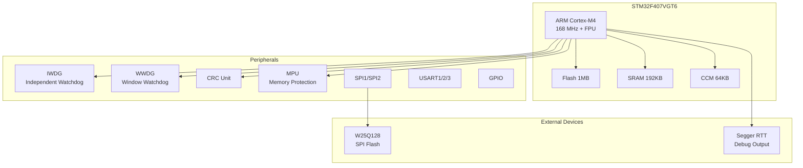

### 1.2 System Component Relations

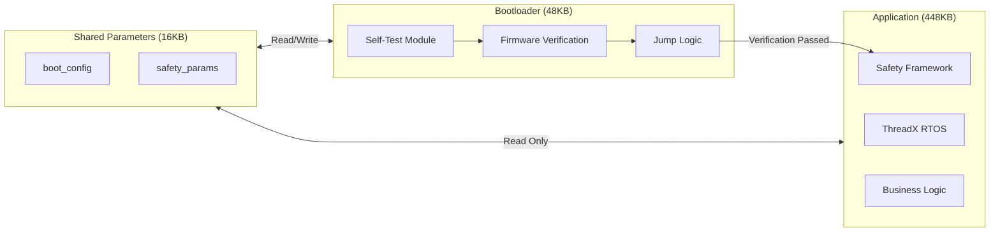

---

## 2. Layer Responsibilities

### 2.1 Six-Layer Architecture

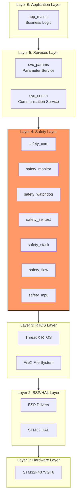

### 2.2 Layer Responsibilities

| Layer | Name | Responsibility |
|------|------|------|
| **Hardware Layer** | Hardware | STM32F407VGT6 MCU, Peripherals: CRC, IWDG, WWDG, MPU, Flash, GPIO |
| **HAL Layer** | Driver | STM32Cube HAL drivers, Hardware abstraction, Unified API |
| **RTOS Layer** | System | Azure RTOS ThreadX 6.1.10, Multi-thread scheduling, Synchronization primitives, Memory management |
| **Safety Layer** | Safety | Functional safety core modules, Self-test, Monitoring, Protection mechanisms |
| **Services Layer** | Services | Parameter management service, Diagnostic service |
| **Application Layer** | Application | Business logic implementation, Application threads |

---

## 3. Memory Layout Details

### 3.1 Flash Partitions

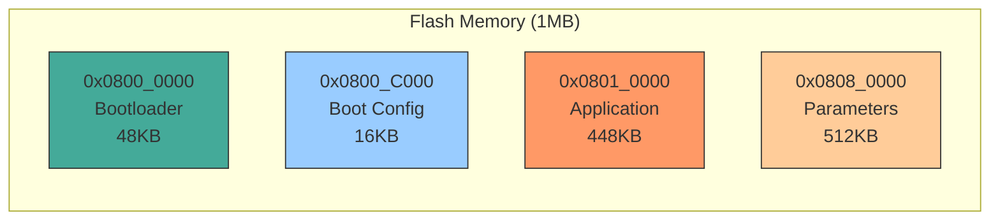

### 3.2 RAM Partitions

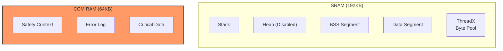

### 3.3 MPU Protection Configuration

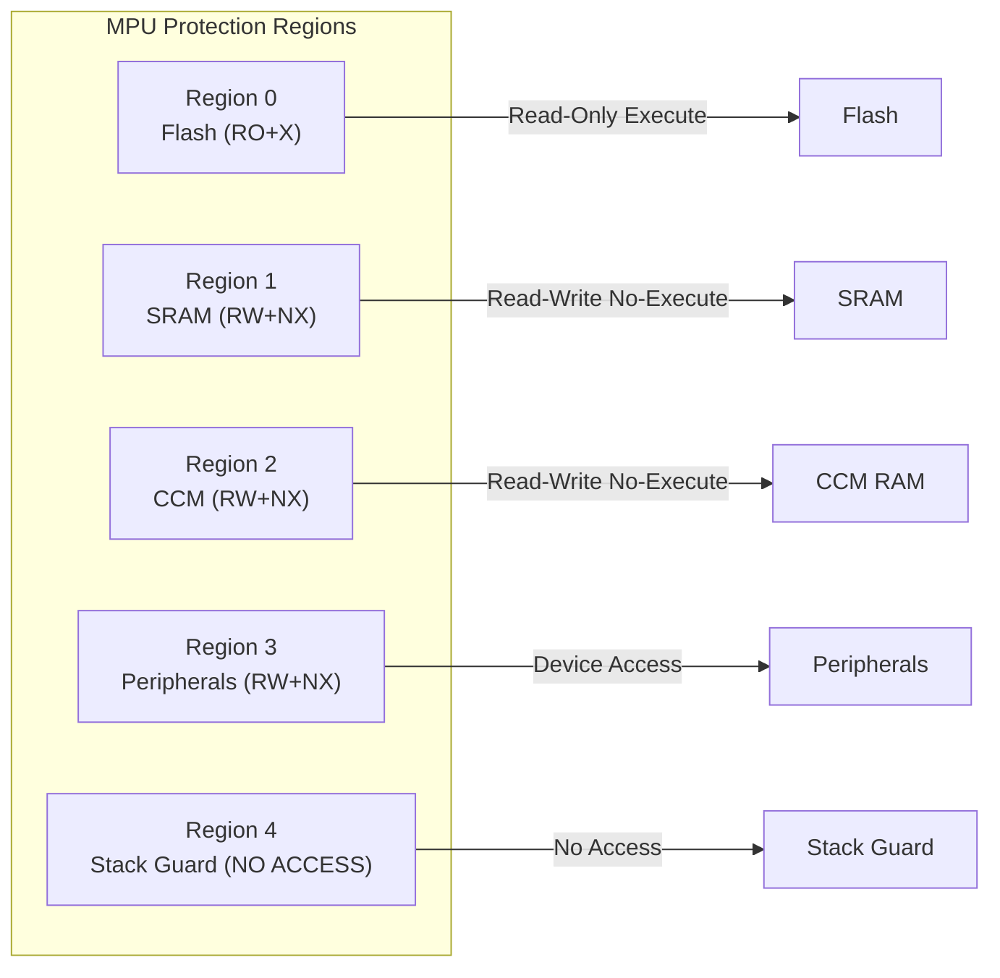

| Region | Start Address | Size | Permissions | Purpose |
|--------|----------|------|------|------|
| 0 | 0x08010000 | 512KB | RO+X | Application Flash |
| 1 | 0x20000000 | 128KB | RW | Main RAM |
| 2 | 0x10000000 | 64KB | RW | CCM RAM (Stacks) |
| 3 | 0x40000000 | 512MB | RW+Device | Peripherals |
| 4 | 0x0800C000 | 16KB | RO | Config Flash |
| 5 | 0x08000000 | 64KB | No Access | Bootloader (Protect) |

---

## 4. Thread Architecture

### 4.1 Thread Priorities

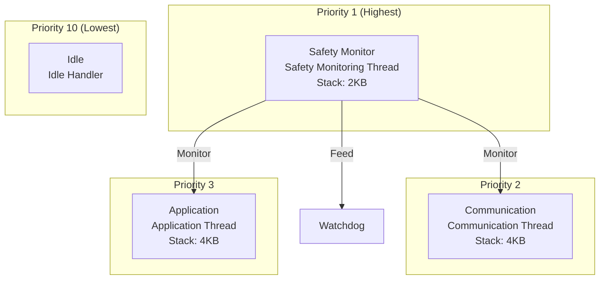

| Thread | Priority | Stack Size | Period | Responsibility |
|------|--------|--------|------|------|
| Safety Monitor | 1 (Highest) | 2KB | 100ms | Safety monitoring |
| App Main | 5 | 4KB | 10ms | Main business logic |
| App Comm | 10 | 2KB | Event-driven | Communication handling |

### 4.2 Thread Interaction

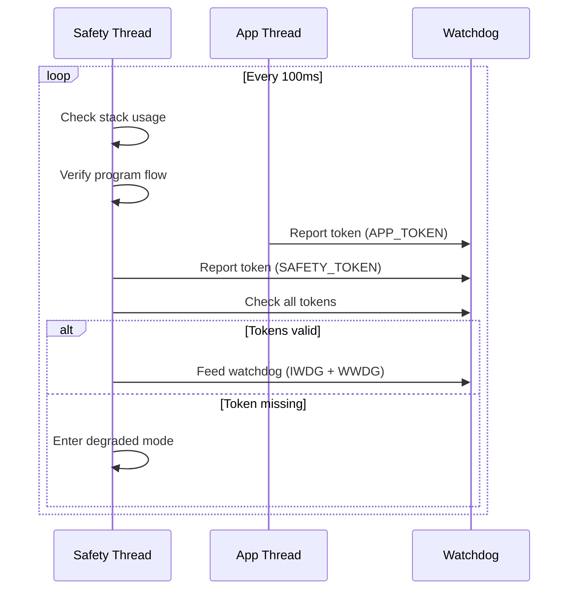

---

## 5. Initialization Sequence

### 5.1 Complete Startup Flow

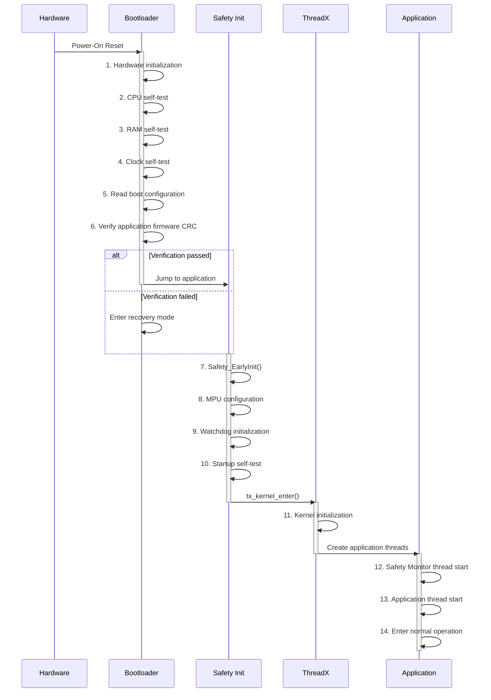

### 5.2 Self-Test Flow

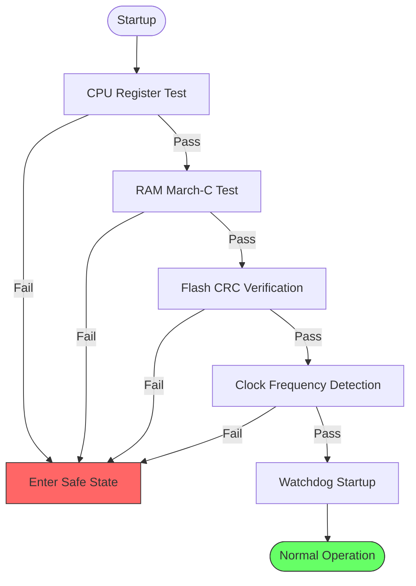

---

## 6. Safety State Machine

### 6.1 Safety State Machine

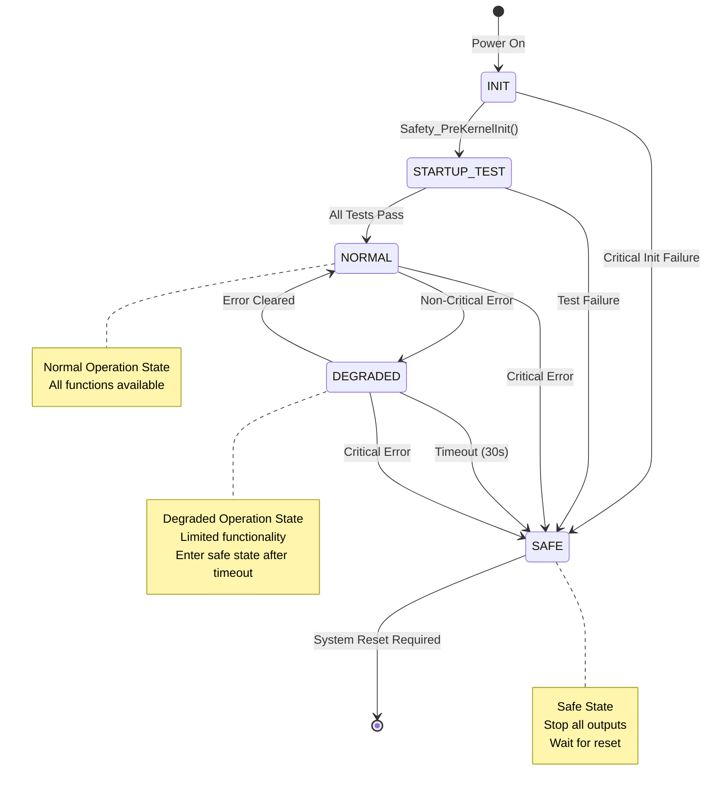

### 6.2 State Descriptions

| State | Value | Description |
|------|-----|------|
| INIT | 0x00 | Initial state, system startup |
| STARTUP_TEST | 0x01 | Executing startup self-test |
| NORMAL | 0x02 | Normal operation state |
| DEGRADED | 0x03 | Degraded operation, limited functionality |
| SAFE | 0x04 | Safe stop state |
| ERROR | 0xFF | Error state |

### 6.3 Bootloader State Machine

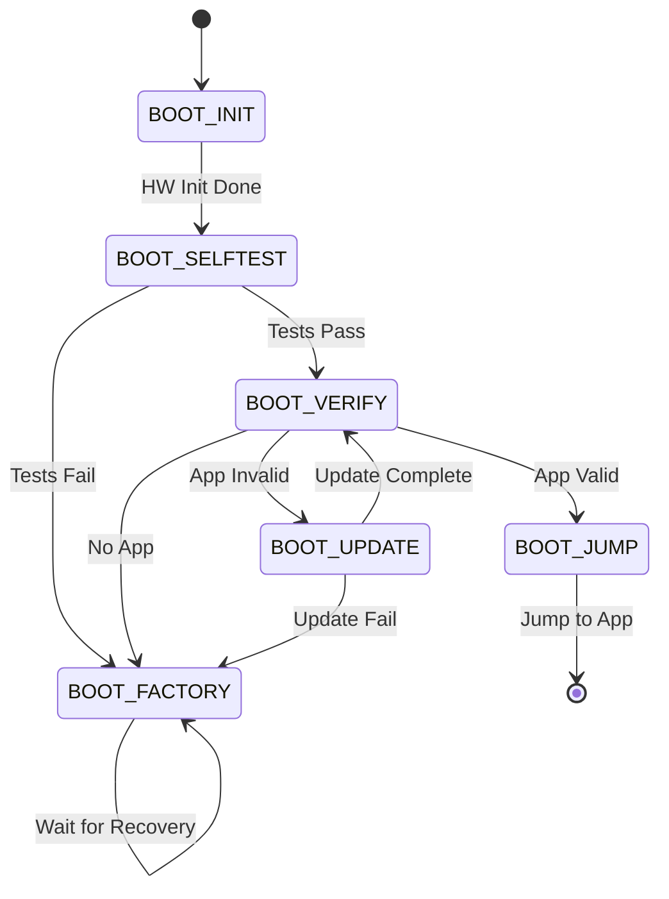

---

## 7. Module Dependencies

### 7.1 Safety Module Architecture

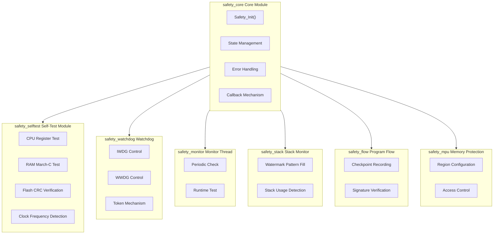

### 7.2 Dual Watchdog Architecture

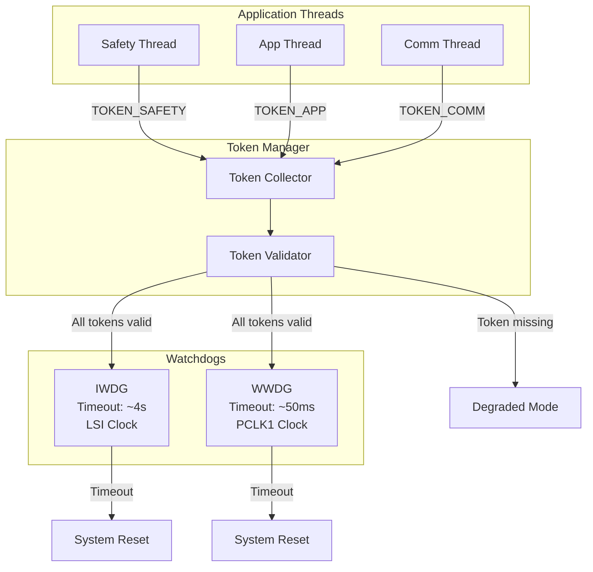

### 7.4 Diagnostic Coverage

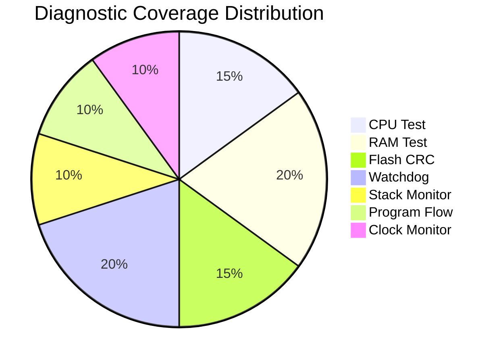

---

## 8. Design Decisions

### 8.1 Separate Bootloader and Application

**Rationale**:
- Bootloader immutability: Once programmed, typically not updated
- Independent safety parameters: Stored in dedicated Flash sector
- Application upgrade support: Can update application independently

### 8.2 Token-Based Watchdog

**Rationale**:
- In multi-threaded environment, single watchdog feed point insufficient to verify all threads are running
- Each critical thread must report a token, watchdog only fed when all tokens collected
- Any thread deadlock will cause watchdog reset

### 8.3 Incremental Flash CRC

**Rationale**:
- Full CRC verification takes too long, affecting real-time performance
- Each check verifies 4KB, completing full verification in 5 minutes
- Balance between safety and performance

### 8.4 CCM RAM for Thread Stacks

**Rationale**:
- CCM RAM accessible only by CPU, more secure
- DMA cannot access CCM, avoiding accidental overwrites
- Stack overflow won't corrupt application data

### 8.5 Redundant Parameter Storage

**Rationale**:
- Critical parameters stored twice (original + bit-inverted)
- Single bit flip can be detected
- Complies with IEC 61508 requirements

---

## 9. CI/CD Workflow

### 9.1 Complete CI/CD Pipeline

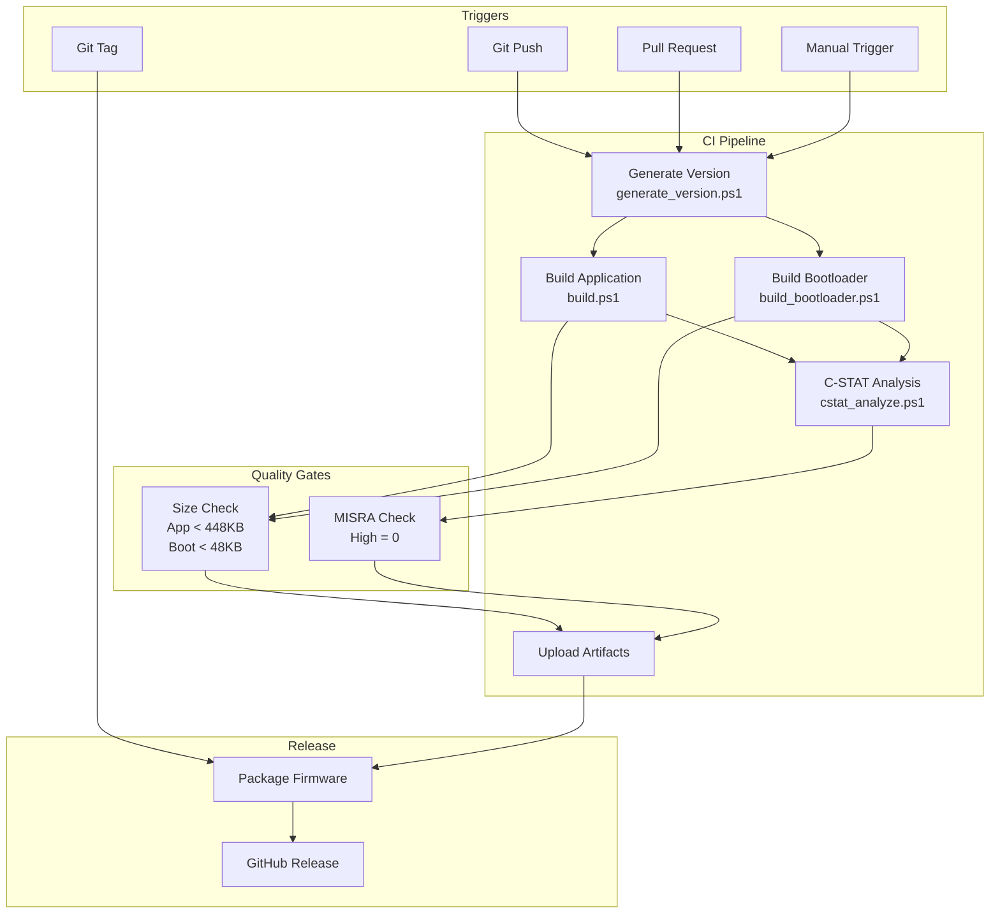

### 9.2 Local Development Workflow

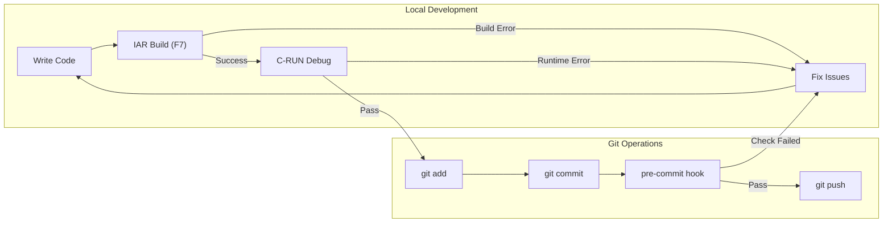

### 9.3 Data Flow

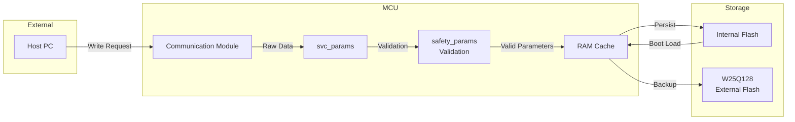

---

## Appendix: Mermaid Usage Guide

### Viewing Options

1. **GitHub** - View directly in GitHub repository, automatically rendered
2. **VS Code** - Install "Markdown Preview Mermaid Support" extension
3. **Online Editor** - https://mermaid.live/

### Local Preview

```bash
# Install mermaid-cli
npm install -g @mermaid-js/mermaid-cli

# Generate PNG
mmdc -i ARCHITECTURE.md -o output.png

# Generate SVG
mmdc -i ARCHITECTURE.md -o output.svg -f svg
```

---

## Version History

| Version | Date | Description |
|------|------|------|
| 1.0.0 | 2025-12-10 | Initial version (ASCII diagrams) |
| 1.0.1 | 2025-12-10 | Integrated Mermaid diagrams, removed redundant files |
