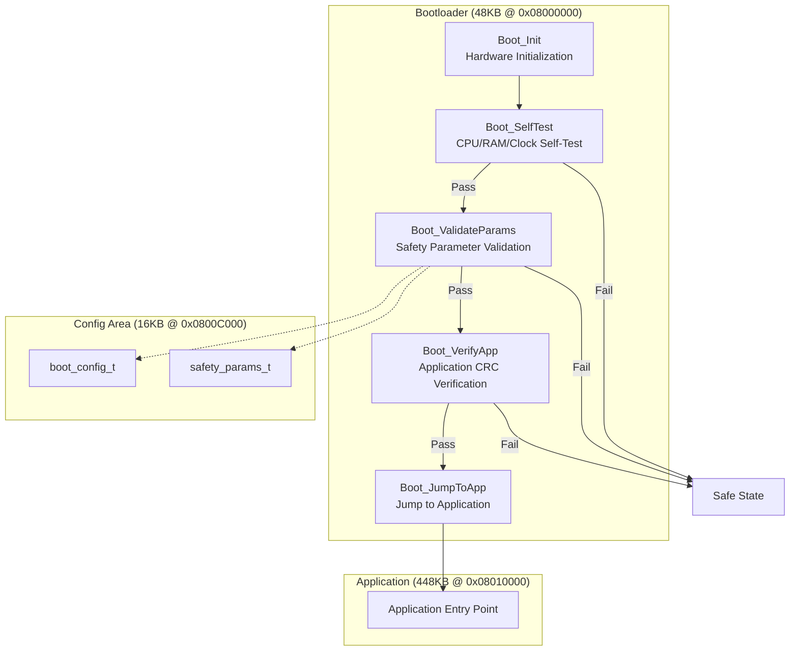
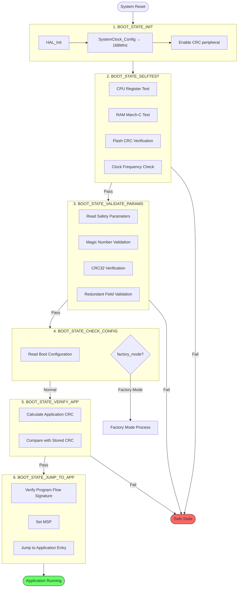

# Bootloader Design Document

**Project**: TKX_ThreadX
**Version**: 1.0.1
**Module**: Safety Bootloader

---

## Overview

The Safety Bootloader is responsible for performing necessary safety checks after system power-on, verifying application integrity, and securely jumping to the main application.

### Bootloader Architecture



## Design Objectives

- Boot-time integrity verification
- Safety parameter validation
- Program flow monitoring
- Enter safe state on failure
- Factory mode support

## Memory Configuration

| Region | Address Range | Size | Description |
|--------|---------------|------|-------------|
| Bootloader Code | 0x08000000 - 0x0800BFFB | 47KB | Bootloader Program |
| Bootloader CRC | 0x0800BFFC - 0x0800BFFF | 4B | Self CRC |
| Config Area | 0x0800C000 - 0x0800FFFF | 16KB | Configuration Parameters |

## Boot Process

### Mermaid Version



## State Definitions

```c
typedef enum {
    BOOT_STATE_INIT         = 0x00U,    /* Initialization */
    BOOT_STATE_SELFTEST     = 0x01U,    /* Self-Test */
    BOOT_STATE_VALIDATE_PARAMS = 0x02U, /* Parameter Validation */
    BOOT_STATE_CHECK_CONFIG = 0x03U,    /* Configuration Check */
    BOOT_STATE_VERIFY_APP   = 0x04U,    /* Application Verification */
    BOOT_STATE_JUMP_TO_APP  = 0x05U,    /* Prepare to Jump */
    BOOT_STATE_FACTORY_MODE = 0x06U,    /* Factory Mode */
    BOOT_STATE_SAFE         = 0xFFU     /* Safe Stop */
} boot_state_t;
```

## Self-Test Module

### CPU Register Test

Test Content:
- R0-R12 general-purpose registers
- LR (Link Register)
- APSR (Application Program Status Register)

Test Method:
- Write test patterns (0xAAAAAAAA, 0x55555555)
- Read back and verify

### RAM Test (March-C)

Test Area: 0x20018000 - 0x2001FFFF (32KB)

March-C Algorithm Steps:
1. ↑ w0 - Write 0 upward
2. ↑ r0,w1 - Read 0 and write 1 upward
3. ↑ r1,w0 - Read 1 and write 0 upward
4. ↓ r0,w1 - Read 0 and write 1 downward
5. ↓ r1,w0 - Read 1 and write 0 downward
6. r0 - Read 0 verification

### Flash CRC Verification

```c
boot_status_t Boot_VerifyAppCRC(void)
{
    uint32_t calc_crc;
    uint32_t stored_crc;

    /* Calculate application area CRC */
    calc_crc = Boot_CRC32_Calculate(
        (uint8_t *)APP_FLASH_START,
        APP_FLASH_SIZE - 4  /* Exclude last 4 bytes CRC */
    );

    /* Read stored CRC */
    stored_crc = *(uint32_t *)APP_CRC_ADDR;

    return (calc_crc == stored_crc) ? BOOT_OK : BOOT_ERROR_CRC;
}
```

### Clock Verification

Verify that the system clock is correctly configured to 168MHz (±5% tolerance allowed).

## Parameter Structures

### boot_config_t

```c
typedef struct __attribute__((packed)) {
    uint32_t magic;         /* 0xC0F16000 */
    uint32_t factory_mode;  /* Factory mode flag */
    uint32_t cal_valid;     /* Calibration data valid flag */
    uint32_t app_crc;       /* Application CRC (for fast verification) */
    uint32_t boot_count;    /* Boot counter */
    uint32_t last_error;    /* Last error code */
    uint32_t reserved[2];   /* Reserved */
    uint32_t crc;           /* Structure CRC32 */
} boot_config_t;
```

### safety_params_t

```c
typedef struct __attribute__((packed)) {
    /* Header - 8 bytes */
    uint32_t magic;             /* 0xCA11B000 */
    uint16_t version;           /* Version 1.0 */
    uint16_t size;              /* Structure size */

    /* HALL sensor calibration - 48 bytes */
    float hall_offset[3];       /* HALL offset */
    float hall_gain[3];         /* HALL gain */
    float hall_offset_inv[3];   /* Offset inverse (redundant) */
    float hall_gain_inv[3];     /* Gain inverse (redundant) */

    /* ADC calibration - 64 bytes */
    float adc_gain[8];          /* ADC channel gain */
    float adc_offset[8];        /* ADC channel offset */

    /* Safety thresholds - 16 bytes */
    float safety_threshold[4];  /* Safety thresholds */

    /* Reserved - 28 bytes */
    uint32_t reserved[7];

    /* Integrity check - 4 bytes */
    uint32_t crc32;             /* CRC32 */
} safety_params_t;
```

## Program Flow Monitoring

### Checkpoint Definitions

```c
typedef enum {
    PFM_CP_INIT             = 0x01U,
    PFM_CP_SELFTEST_START   = 0x02U,
    PFM_CP_SELFTEST_END     = 0x07U,
    PFM_CP_PARAMS_CHECK     = 0x08U,
    PFM_CP_CONFIG_CHECK     = 0x09U,
    PFM_CP_APP_VERIFY       = 0x0BU,
    PFM_CP_JUMP_PREPARE     = 0x0DU,
    PFM_CP_JUMP_EXECUTE     = 0x0EU
} pfm_checkpoint_t;
```

### Signature Calculation

```c
static void Boot_FlowMonitor_Update(pfm_checkpoint_t checkpoint)
{
    s_flow_signature ^= ((uint32_t)checkpoint << 24) |
                        ((uint32_t)checkpoint << 16) |
                        ((uint32_t)checkpoint << 8) |
                        ((uint32_t)checkpoint);
}
```

Verify the signature before jumping to ensure all checkpoints are executed in sequence.

## Jump to Application

```c
void Boot_JumpToApplication(void)
{
    typedef void (*pFunction)(void);
    pFunction Jump_To_Application;
    uint32_t JumpAddress;

    /* Disable all interrupts */
    __disable_irq();

    /* De-initialize peripherals */
    HAL_DeInit();

    /* Get application entry address */
    JumpAddress = *(__IO uint32_t *)(APP_FLASH_START + 4);
    Jump_To_Application = (pFunction)JumpAddress;

    /* Set main stack pointer */
    __set_MSP(*(__IO uint32_t *)APP_FLASH_START);

    /* Jump */
    Jump_To_Application();
}
```

## Safe Stop State

Enter safe stop state when the following errors are detected:

- Self-test failure
- Safety parameter verification failure
- Application CRC error
- Program flow signature error

Safe Stop Behavior:
1. Disable all interrupts
2. Set all outputs to safe state
3. Stop watchdog feeding, wait for watchdog reset
4. Or enter infinite loop waiting

## Factory Mode

Factory mode is triggered by setting the `factory_mode` flag via debugger:

1. Debugger writes `factory_mode = 1` to Config Flash
2. System reset
3. Bootloader detects factory mode flag
4. Enter factory mode processing
5. Clear flag and reset after completion

Factory Mode Uses:
- Calibration data writing
- Parameter configuration
- Production testing

## API Reference

### Boot_Main

```c
void Boot_Main(void);
```
Bootloader main entry function, executes the complete boot process.

### Boot_GetState

```c
boot_state_t Boot_GetState(void);
```
Get current Bootloader state.

### Boot_EnterSafeState

```c
void Boot_EnterSafeState(boot_status_t error);
```
Enter safe stop state.

### Boot_ValidateSafetyParams

```c
boot_status_t Boot_ValidateSafetyParams(safety_params_t *params);
```
Verify safety parameter integrity.

### Boot_VerifyAppCRC

```c
boot_status_t Boot_VerifyAppCRC(void);
```
Verify application CRC.

## Build Configuration

### IAR Linker Configuration

```
define symbol __ICFEDIT_region_ROM_start__ = 0x08000000;
define symbol __ICFEDIT_region_ROM_end__   = 0x0800BFFF;
define symbol __ICFEDIT_region_RAM_start__ = 0x20000000;
define symbol __ICFEDIT_region_RAM_end__   = 0x2001FFFF;

define region ROM_region = mem:[from __ICFEDIT_region_ROM_start__
                                to   __ICFEDIT_region_ROM_end__];
```

### CRC Location

Reserve the last 4 bytes in the linker script for storing CRC:

```
place at address mem:0x0800BFFC { readonly section .boot_crc };
```
