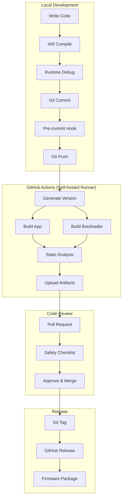
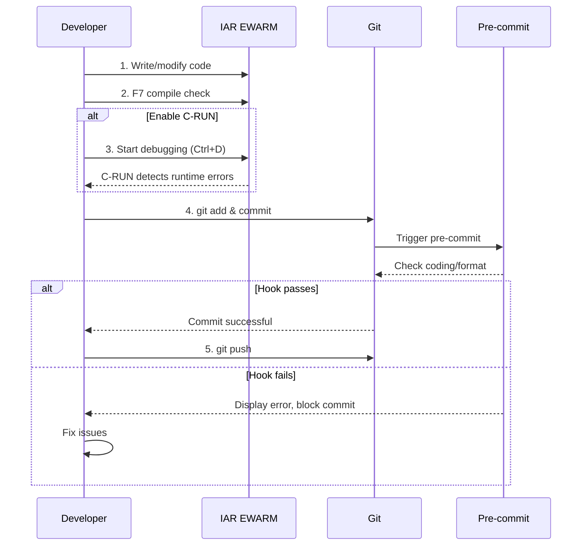
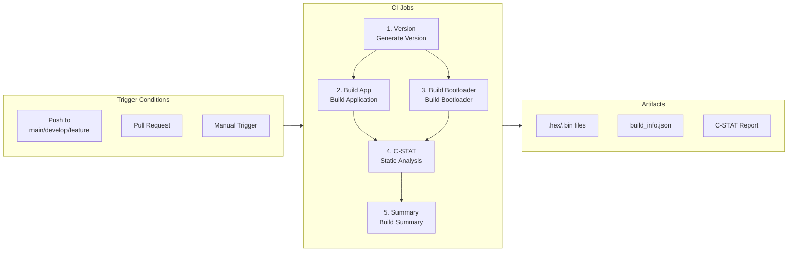
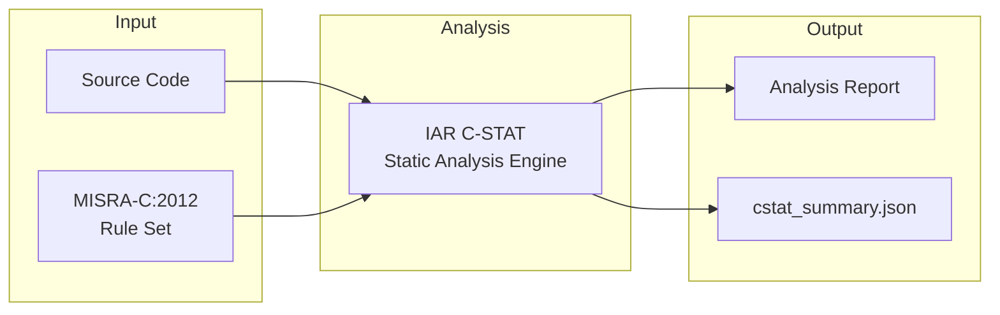
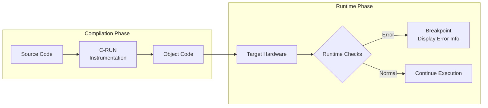
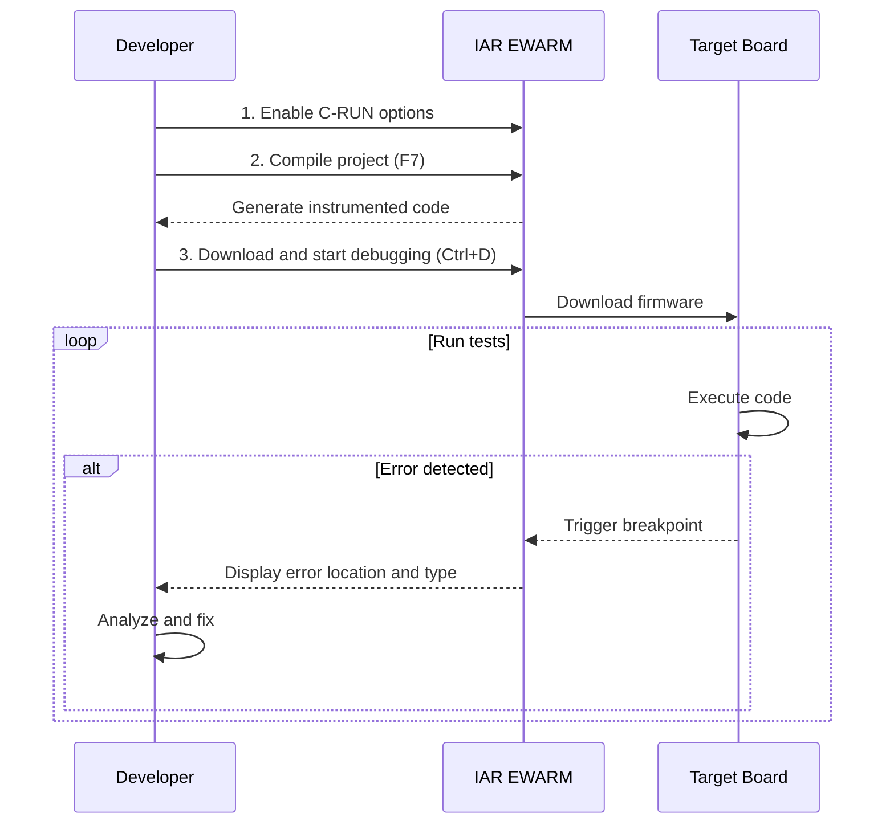
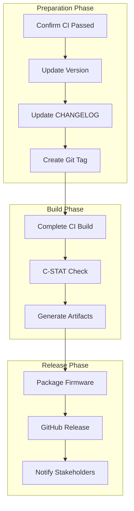

# CI/CD Workflow Guide

**Project**: TKX_ThreadX
**Compliance**: IEC 61508 SIL 2 / ISO 13849 PL d / MISRA-C:2012
**Version**: 1.0.0

---

## Table of Contents

1. [Overview](#1-overview)
2. [Toolchain Architecture](#2-toolchain-architecture)
3. [Local Development](#3-local-development)
4. [CI/CD Pipeline](#4-cicd-pipeline)
5. [Build Scripts Usage](#5-build-scripts-usage)
6. [Static Analysis](#6-static-analysis)
7. [Runtime Analysis](#7-runtime-analysis)
8. [Version Management](#8-version-management)
9. [Release Process](#9-release-process)

---

## 1. Overview

### 1.1 Workflow Architecture



### 1.2 Toolchain Overview

| Tool | Purpose | When |
|------|---------|------|
| **IAR EWARM** | Compilation and Build | Local + CI |
| **C-STAT** | MISRA-C Static Analysis | CI Automatic |
| **C-RUN** | Runtime Error Detection | Local Debug |
| **GitHub Actions** | CI/CD Automation | Git Push |
| **Pre-commit Hook** | Code Style Check | Git Commit |

---

## 2. Toolchain Architecture

### 2.1 Directory Structure

```
TKX_ThreadX/
├── .github/
│   ├── workflows/
│   │   └── ci-build.yml          # CI workflow configuration
│   └── PULL_REQUEST_TEMPLATE.md  # PR safety checklist
├── CI/
│   ├── scripts/
│   │   ├── build.ps1             # Main build script
│   │   ├── build_bootloader.ps1  # Bootloader build
│   │   ├── build_crun.ps1        # C-RUN build
│   │   ├── cstat_analyze.ps1     # C-STAT static analysis
│   │   └── generate_version.ps1  # Version info generation
│   └── hooks/
│       └── pre-commit            # Git pre-commit hook
├── Docs/
│   ├── CODING_STANDARD.md        # Coding standard
│   ├── SAFETY_CHECKLIST.md       # Safety checklist
│   └── CI_CD_WORKFLOW.md         # This document
├── .editorconfig                 # Editor configuration
├── .clang-format                 # Code formatting configuration
└── artifacts/                    # Build artifacts (gitignored)
    ├── TKX_ThreadX.hex
    ├── TKX_ThreadX.bin
    ├── build_info.json
    └── cstat/
        └── cstat_summary.json
```

### 2.2 IAR Tool Paths

```
D:\iar\ewarm-9.70.1\
├── common\bin\
│   └── iarbuild.exe              # Command line build tool
├── arm\bin\
│   ├── iccarm.exe                # C compiler
│   ├── ilinkarm.exe              # Linker
│   └── ielftool.exe              # ELF conversion tool
└── arm\config\
    └── debugger\                 # Debugger configuration
```

---

## 3. Local Development

### 3.1 Environment Setup

```powershell
# 1. Install pre-commit hook
cp ci/hooks/pre-commit .git/hooks/
# On Windows, you may need to use Git Bash

# 2. Verify IAR path
D:\iar\ewarm-9.70.1\common\bin\iarbuild.exe
```

### 3.2 Development Flow



### 3.3 Daily Commands

```powershell
# Local build
.\ci\scripts\build.ps1 -Rebuild -GenerateHex -GenerateBin

# Compile check only
.\ci\scripts\build.ps1

# Build Bootloader
.\ci\scripts\build_bootloader.ps1 -Rebuild

# Local C-STAT
.\ci\scripts\cstat_analyze.ps1

# Generate version
.\ci\scripts\generate_version.ps1
```

---

## 4. CI/CD Pipeline

### 4.1 Pipeline Architecture



### 4.2 GitHub Actions Configuration

**Location**: `.github/workflows/ci-build.yml`

```yaml
# Triggers
on:
  push:
    branches: [main, develop, 'feature/**']
  pull_request:
    branches: [main, develop]
  workflow_dispatch:  # Manual trigger

# Runner
runs-on: [self-hosted, Windows, IAR]

# Main Jobs
jobs:
  version:        # Generate version info
  build-app:      # Build main application
  build-bootloader: # Build bootloader
  static-analysis:  # C-STAT analysis
  summary:        # Build summary
```

### 4.3 Self-hosted Runner Setup

**Requirements**:
- Windows 10/11 or Windows Server
- IAR EWARM 9.70.1 (D:\iar\ewarm-9.70.1)
- IAR License (PC-locked)
- Git for Windows

**Installation**:
```powershell
# 1. Get Runner installation package from GitHub repository settings
# Settings → Actions → Runners → New self-hosted runner

# 2. Download and extract to C:\actions-runner

# 3. Configure Runner
.\config.cmd --url https://github.com/YOUR_ORG/TKX_ThreadX `
             --token YOUR_TOKEN `
             --labels "self-hosted,Windows,IAR"

# 4. Install as Windows service
.\svc.sh install
.\svc.sh start
```

---

## 5. Build Scripts Usage

### 5.1 build.ps1 - Main Build Script

```powershell
# Syntax
.\ci\scripts\build.ps1 [Parameters]

# Parameters
-Configuration    # Build configuration name (default: TKX_ThreadX)
-IARPath          # IAR installation path (default: D:\iar\ewarm-9.70.1)
-ProjectPath      # Project file path
-Clean            # Clean build
-Rebuild          # Complete rebuild
-GenerateHex      # Generate HEX file
-GenerateBin      # Generate BIN file
-Verbose          # Verbose output
```

**Examples**:
```powershell
# Complete rebuild with output files
.\ci\scripts\build.ps1 -Rebuild -GenerateHex -GenerateBin

# Clean only
.\ci\scripts\build.ps1 -Clean

# Incremental build
.\ci\scripts\build.ps1

# Specify project
.\ci\scripts\build.ps1 -ProjectPath "C:\Projects\MyProject.ewp"
```

### 5.2 build_bootloader.ps1 - Bootloader Build

```powershell
# Syntax
.\ci\scripts\build_bootloader.ps1 [Parameters]

# Example
.\ci\scripts\build_bootloader.ps1 -Rebuild
```

### 5.3 build_crun.ps1 - C-RUN Build

```powershell
# Syntax
.\ci\scripts\build_crun.ps1 [Parameters]

# Description
# Build version with C-RUN runtime checks enabled
# Requires C-RUN check items to be enabled in IAR project options
```

---

## 6. Static Analysis

### 6.1 C-STAT Overview



### 6.2 cstat_analyze.ps1 Usage

```powershell
# Syntax
.\ci\scripts\cstat_analyze.ps1 [Parameters]

# Parameters
-Configuration    # Build configuration name
-IARPath          # IAR installation path
-ProjectPath      # Project file path
-OutputFormat     # Output format (html, xml, txt)
-FailOnHigh       # Fail on high severity issues
-FailOnMedium     # Fail on medium severity issues

# Example
.\ci\scripts\cstat_analyze.ps1 -FailOnHigh
```

### 6.3 Excluded Paths

The following third-party code is excluded from MISRA checking:
```
Middlewares/ST/threadx/*
Middlewares/ST/filex/*
Drivers/CMSIS/*
ThirdParty/SEGGER/*
```

### 6.4 C-STAT Report Interpretation

| Severity | Action |
|----------|--------|
| **High** | Must fix |
| **Medium** | Should fix |
| **Low** | Consider fixing |

**Output Files**:
- `artifacts/cstat/C-STAT_Messages_Filtered.txt` - Filtered report
- `artifacts/cstat/cstat_summary.json` - JSON summary

---

## 7. Runtime Analysis

### 7.1 C-RUN Overview

C-RUN detects runtime errors during **target hardware debugging**:



### 7.2 C-RUN Configuration

**Location**: Project → Options → C/C++ Compiler → Runtime Checking

| Check | Description |
|-------|-------------|
| ☑ Bounds checking | Array out-of-bounds detection |
| ☑ Integer overflow | Signed integer overflow |
| ☑ Unsigned overflow | Unsigned integer overflow |
| ☑ Shift overflow | Shift operation overflow |
| ☑ Division by zero | Division by zero detection |
| ☑ Unhandled case | Unhandled switch cases |

### 7.3 C-RUN Usage Flow



---

## 8. Version Management

### 8.1 Version Generation

```powershell
# Generate version header file
.\ci\scripts\generate_version.ps1

# Specify version number
.\ci\scripts\generate_version.ps1 -MajorVersion 1 -MinorVersion 2 -PatchVersion 0
```

### 8.2 Generated Version Info

**File**: `Core/Inc/version_info.h`

```c
#define VERSION_MAJOR           1
#define VERSION_MINOR           0
#define VERSION_PATCH           0
#define VERSION_BUILD           2412101530

#define GIT_COMMIT              "abc1234"
#define GIT_BRANCH              "main"
#define GIT_TAG                 "v1.0.0"
#define GIT_DIRTY               0

#define BUILD_DATE              "2025-12-10"
#define BUILD_TIMESTAMP         "2025-12-10T15:30:00Z"

#define VERSION_STRING          "1.0.0"
#define VERSION_FULL            "1.0.0+2512101530"
```

### 8.3 Build Info JSON

**File**: `artifacts/build_info.json`

```json
{
  "project": "TKX_ThreadX",
  "version": "1.0.0",
  "build_number": "2512101530",
  "timestamp": "2025-12-10T15:30:00Z",
  "git": {
    "commit": "abc1234",
    "branch": "main",
    "tag": "v1.0.0",
    "dirty": false
  },
  "toolchain": {
    "iar_version": "9.70.1"
  }
}
```

---

## 9. Release Process

### 9.1 Release Flow



### 9.2 Release Checklist

```markdown
## Pre-Release Checklist

### Code Quality
- [ ] All CI checks passed
- [ ] No high severity C-STAT issues
- [ ] Code review completed

### Testing
- [ ] C-RUN runtime tests passed
- [ ] Functional tests passed
- [ ] Safety self-tests passed

### Documentation
- [ ] CHANGELOG updated
- [ ] Version number updated
- [ ] Release notes prepared

### Artifacts
- [ ] TKX_ThreadX.hex generated
- [ ] TKX_ThreadX.bin generated
- [ ] Bootloader.hex generated
- [ ] build_info.json generated
```

### 9.3 Create Release

```bash
# 1. Ensure on main branch
git checkout main
git pull

# 2. Create and push tag
git tag -a v1.0.0 -m "Release v1.0.0"
git push origin v1.0.0

# 3. GitHub Actions automatically triggers release build
# Or manually trigger release workflow
```

### 9.4 Release Artifacts

```
TKX_ThreadX-v1.0.0/
├── TKX_ThreadX.hex          # Main application (Intel HEX)
├── TKX_ThreadX.bin          # Main application (Binary)
├── Bootloader.hex           # Bootloader (Intel HEX)
├── Bootloader.bin           # Bootloader (Binary)
├── build_info.json          # Build information
├── cstat_summary.json       # C-STAT analysis summary
└── RELEASE_NOTES.md         # Release notes
```

---

## Appendix A: Troubleshooting

### A.1 Common Issues

| Issue | Solution |
|-------|----------|
| iarbuild.exe not found | Check IAR_PATH environment variable |
| License error | Ensure running on licensed machine |
| CI build failure | Check Self-hosted Runner status |
| Empty C-STAT report | Confirm project compiled successfully |

### A.2 Log Locations

```
artifacts/
├── build_stdout.log         # Build output
├── build_stderr.log         # Build errors
└── cstat/
    ├── C-STAT_Messages_Full.txt     # Full report
    └── C-STAT_Messages_Filtered.txt # Filtered report
```

---

## Version History

| Version | Date | Description |
|---------|------|-------------|
| 1.0.0 | 2025-12-10 | Initial version |
