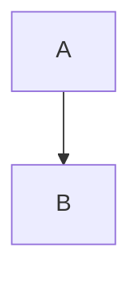
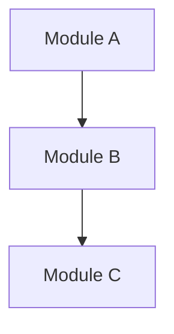

# Documentation Style Guide

**Project**: TKX_ThreadX
**Version**: 1.0.0

---

## 1. Document Structure

### 1.1 File Header

All documents must start with a standard header:

```markdown
# Document Title

**Project**: TKX_ThreadX
**Version**: x.x.x

---
```

### 1.2 Table of Contents

Long documents (over 200 lines) should include a table of contents:

```markdown
## Table of Contents

1. [Chapter One](#1-chapter-one)
2. [Chapter Two](#2-chapter-two)
   - [Sub-chapter](#21-sub-chapter)
```

### 1.3 Version History

Document should include version history at the end (optional):

```markdown
## Version History

| Version | Date | Description |
|---------|------|-------------|
| 1.0.0 | 2025-12-10 | Initial version |
```

---

## 2. Heading Standards

### 2.1 Heading Levels

| Level | Purpose | Example |
|-------|---------|---------|
| `#` | Document title (only one) | `# Architecture Design` |
| `##` | Main sections | `## 1. System Overview` |
| `###` | Sub-sections | `### 1.1 Hardware Architecture` |
| `####` | Detailed content | `#### API Parameters` |

### 2.2 Numbering Rules

- Main sections use numeric numbering: `## 1. Section Name`
- Sub-sections use decimal notation: `### 1.1 Sub-section Name`
- Unstructured sections may omit numbering

---

## 3. Code Block Standards

### 3.1 Language Identifiers

Always specify the code language:

````markdown
```c
// C code
int main(void) { return 0; }
```


````

### 3.2 Code Comments

Code examples should include necessary comments:

```c
/* Initialize safety module */
Safety_Init();

/* Check return value */
if (status != STATUS_OK)
{
    /* Error handling */
}
```

---

## 4. Diagram Standards

### 4.1 Mermaid Diagrams

Prefer using Mermaid for diagrams:



**Supported Diagram Types**:

| Type | Purpose |
|------|---------|
| `graph TB/LR` | Flowcharts, architecture diagrams |
| `sequenceDiagram` | Sequence diagrams |
| `stateDiagram-v2` | State machines |
| `flowchart` | Flowcharts |
| `pie` | Pie charts |

### 4.2 Diagram Styling

- Use English labels
- Add colors to key nodes: `style NODE fill:#f96`
- Use `subgraph` for grouping

---

## 5. Table Standards

### 5.1 Basic Format

```markdown
| Column 1 | Column 2 | Column 3 |
|----------|----------|----------|
| Value 1  | Value 2  | Value 3  |
```

### 5.2 Alignment

- Default left alignment
- Numeric columns can be right-aligned: `|---:|`
- Headers can be center-aligned: `|:---:|`

---

## 6. Link Standards

### 6.1 Internal Document Links

```markdown
See [Section Name](#section-anchor)
```

### 6.2 Inter-document Links

```markdown
See [Architecture Design](ARCHITECTURE.md)
See [Architecture Design - Memory Layout](ARCHITECTURE.md#3-memory-layout-details)
```

### 6.3 External Links

```markdown
Reference [ThreadX Documentation](https://docs.microsoft.com/azure/rtos/threadx/)
```

---

## 7. Terminology and Abbreviations

### 7.1 First Occurrence

Full term should be provided when using abbreviation for the first time:

```markdown
MPU (Memory Protection Unit)
```

### 7.2 Common Abbreviations Table

| Abbreviation | Full Term | Description |
|--------------|-----------|-------------|
| MCU | Microcontroller Unit | Microcontroller |
| MPU | Memory Protection Unit | Memory Protection Unit |
| RTOS | Real-Time Operating System | Real-Time Operating System |
| CRC | Cyclic Redundancy Check | Cyclic Redundancy Check |
| HAL | Hardware Abstraction Layer | Hardware Abstraction Layer |
| BSP | Board Support Package | Board Support Package |
| IWDG | Independent Watchdog | Independent Watchdog |
| WWDG | Window Watchdog | Window Watchdog |
| SIL | Safety Integrity Level | Safety Integrity Level |
| PL | Performance Level | Performance Level |

---

## 8. Naming Conventions

### 8.1 Directory Naming

- Use PascalCase (first letter capitalized)
- Examples: `Docs/`, `CI/`, `App/`, `Safety/`

### 8.2 Document File Naming

- Use uppercase letters and underscores
- Lowercase file extension `.md`
- Examples: `ARCHITECTURE.md`, `CODING_STANDARD.md`

### 8.3 Code File Naming

- Use lowercase letters and underscores (snake_case)
- Examples: `safety_core.c`, `app_main.h`

---

## 9. Language Standards

### 9.1 Bilingual Support

Important terms may use bilingual format:

```markdown
## System Overview
```

### 9.2 Technical Accuracy

- Do not make unsubstantiated compliance claims
- Numbers must include units
- Addresses use hexadecimal format: `0x08000000`

---

## 10. Document Checklist

| Document | Filename | Description |
|----------|----------|-------------|
| Project Overview | README.md | Project overview, quick start |
| Architecture Design | ARCHITECTURE.md | System architecture, design decisions |
| Bootloader | BOOTLOADER.md | Bootloader design |
| Safety Modules | SAFETY_MODULES.md | Safety module API |
| Service Layer | SERVICES.md | Service layer interface |
| Application Layer | APP_LAYER.md | Application development guide |
| Coding Standards | CODING_STANDARD.md | C code standards |
| CI/CD | CI_CD_WORKFLOW.md | Automated build |
| Safety Checklist | SAFETY_CHECKLIST.md | Release checklist |
| Documentation Style Guide | DOC_STYLE_GUIDE.md | This document |
