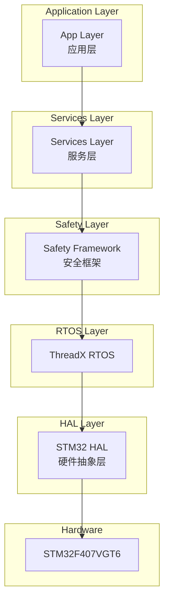
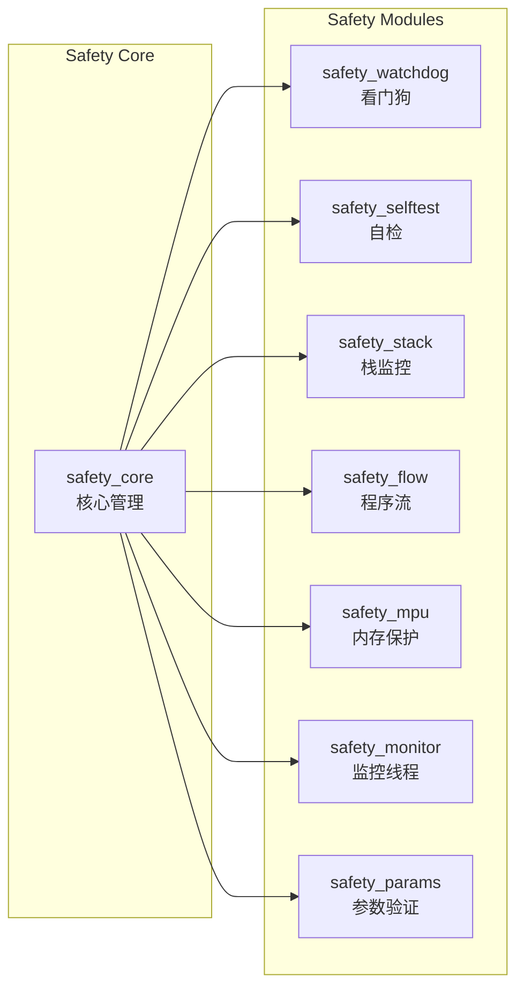
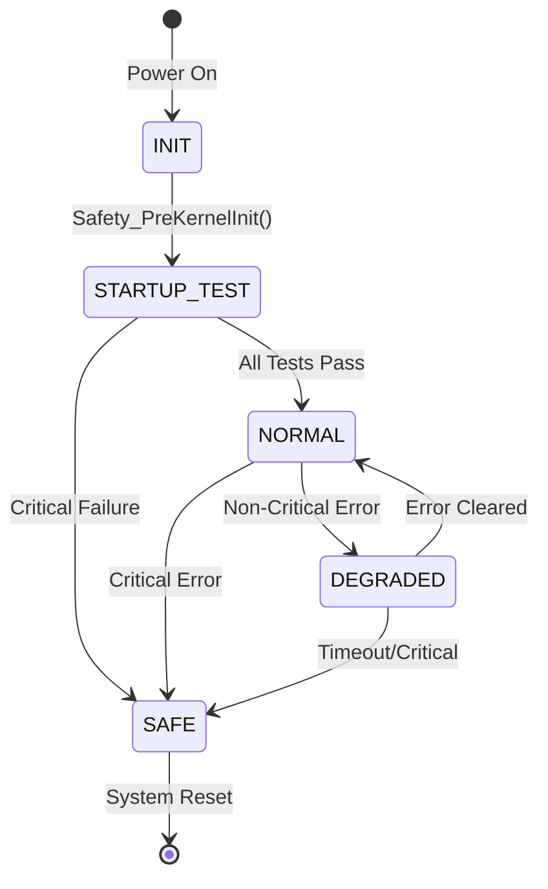
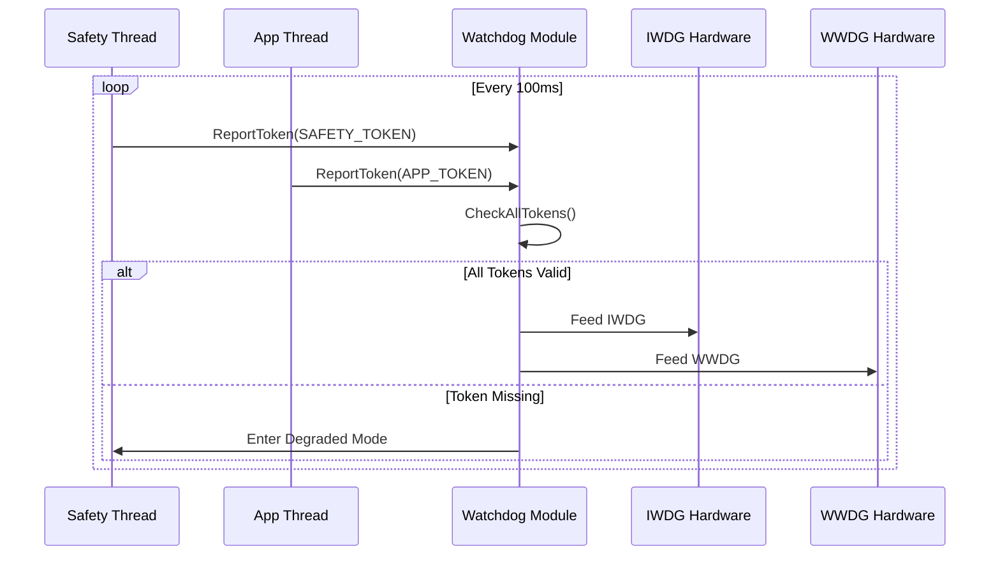

# Functional Safety Checklist

**Project**: TKX_ThreadX
**Compliance**: IEC 61508 SIL 2 / ISO 13849 PL d
**Version**: 1.0.0

---

## Table of Contents

1. [System Architecture](#1-system-architecture)
2. [Design Phase Checks](#2-design-phase-checks)
3. [Coding Phase Checks](#3-coding-phase-checks)
4. [Testing Phase Checks](#4-testing-phase-checks)
5. [Code Review Points](#5-code-review-points)
6. [MISRA-C Compliance](#6-misra-c-compliance)
7. [Release Checks](#7-release-checks)

---

## 1. System Architecture

### 1.1 System Layer Structure



### 1.2 Safety Module Architecture



### 1.3 Safety State Machine



### 1.4 Watchdog Token Mechanism



---

## 2. Design Phase Checks

### 2.1 Architecture Design

| Check Item | Requirement | Status |
|------------|-------------|--------|
| Layered Architecture | Clear layered architecture used | ☐ |
| Module Independence | Low coupling between modules | ☐ |
| Error Propagation | Errors should not propagate across layers | ☐ |
| Safety Isolation | Safety functions isolated from non-safety functions | ☐ |
| Memory Protection | MPU protects critical regions | ☐ |

### 2.2 Safety Analysis

| Check Item | Requirement | Status |
|------------|-------------|--------|
| FMEA Analysis | Failure mode analysis completed | ☐ |
| Diagnostic Coverage | DC ≥ 90% (runtime) | ☐ |
| Common Cause Failure | CCF identified and mitigated | ☐ |
| Safety Functions | All safety functions identified | ☐ |

---

## 3. Coding Phase Checks

### 3.1 Coding Standards

| Check Item | Requirement | Status |
|------------|-------------|--------|
| Naming Convention | Follow CODING_STANDARD.md | ☐ |
| Doxygen Comments | All public functions documented | ☐ |
| Header Format | Use standard template | ☐ |
| Type Safety | Use stdint.h types | ☐ |
| Constant Suffix | Numeric constants have U/UL suffix | ☐ |

### 3.2 Defensive Programming

| Check Item | Requirement | Status |
|------------|-------------|--------|
| Input Validation | All external inputs validated | ☐ |
| Null Pointer Check | Check all pointer parameters | ☐ |
| Boundary Check | Array access has bounds check | ☐ |
| Return Value Check | Check all function return values | ☐ |
| Initialization | All variables initialized | ☐ |

### 3.3 Safety Mechanisms

| Check Item | Requirement | Status |
|------------|-------------|--------|
| Watchdog Feeding | Correctly report tokens | ☐ |
| Stack Monitoring | Thread registered for stack monitoring | ☐ |
| Program Flow | Use flow checkpoints | ☐ |
| Error Handling | Errors properly reported | ☐ |
| Safe State | Can enter safe state | ☐ |

---

## 4. Testing Phase Checks

### 4.1 Unit Testing

| Check Item | Requirement | Status |
|------------|-------------|--------|
| Test Coverage | Code coverage ≥ 80% | ☐ |
| Boundary Testing | Boundary conditions tested | ☐ |
| Error Path | Error handling paths tested | ☐ |
| Mock Usage | Hardware dependencies mocked | ☐ |

### 4.2 Integration Testing

| Check Item | Requirement | Status |
|------------|-------------|--------|
| Interface Testing | Module interfaces tested | ☐ |
| State Transition | State machine transitions verified | ☐ |
| Timing Testing | Timing requirements verified | ☐ |
| Load Testing | Tested under load | ☐ |

### 4.3 Safety Testing

| Check Item | Requirement | Status |
|------------|-------------|--------|
| Fault Injection | Fault injection performed | ☐ |
| Watchdog Testing | Watchdog timeout verified | ☐ |
| Self-test Verification | All self-tests verified | ☐ |
| Safe State Testing | Safe state reachable | ☐ |
| Recovery Testing | Error recovery tested | ☐ |

---

## 5. Code Review Points

### 5.1 Mandatory Review Items

```markdown
## Code Review Checklist

### Safety Related
- [ ] No dynamic memory allocation
- [ ] No infinite loops without exit
- [ ] All functions have return value checks
- [ ] Critical data has redundancy
- [ ] State machine transition validation

### Code Quality
- [ ] Complies with CODING_STANDARD.md
- [ ] Meaningful naming
- [ ] Appropriate comments
- [ ] No magic numbers
- [ ] No code duplication

### MISRA-C Compliance
- [ ] No new high severity issues
- [ ] Medium severity issues reviewed
- [ ] Deviations documented
```

### 5.2 Review Issue Classification

| Severity | Description | Action |
|----------|-------------|--------|
| **Critical** | Safety issue, data corruption risk | Must fix before merge |
| **Major** | Functional defect, MISRA high violation | Should fix before merge |
| **Minor** | Code style, readability | Can fix later |
| **Info** | Suggestions, optimizations | Optional fix |

---

## 6. MISRA-C Compliance

### 6.1 C-STAT Analysis Configuration

```
Excluded Paths:
- Middlewares/ST/*        (ThreadX, FileX)
- Drivers/CMSIS/*         (ARM CMSIS)
- ThirdParty/*            (Segger RTT/SystemView)

Check Scope:
- Safety/*                (Safety modules)
- App/*                   (Application)
- Services/*              (Services)
- BSP/*                   (Board Support Package)
- Shared/*                (Shared code)
```

### 6.2 Compliance Targets

| Rule Category | Target |
|---------------|--------|
| Mandatory Rules | 100% compliant |
| Required Rules | ≥ 95% compliant |
| Advisory Rules | ≥ 80% compliant |
| High Severity Issues | 0 issues |
| Medium Severity Issues | Documented |

---

## 7. Release Checks

### 7.1 Pre-Release Checklist

| Check Item | Requirement | Status |
|------------|-------------|--------|
| CI Build Pass | All CI checks passed | ☐ |
| Test Report | All tests passed | ☐ |
| C-STAT Report | No high severity issues | ☐ |
| Code Review | All code reviewed | ☐ |
| Documentation Update | Documentation synced with code | ☐ |
| Version Number Update | Version number updated | ☐ |
| Changelog | CHANGELOG updated | ☐ |

### 7.2 Release Artifacts

```
TKX_ThreadX-vX.Y.Z/
├── TKX_ThreadX.hex          # Main application
├── TKX_ThreadX.bin          # Main application (binary)
├── Bootloader.hex           # Bootloader
├── Bootloader.bin           # Bootloader (binary)
├── build_info.json          # Build information
├── cstat_summary.json       # C-STAT summary
├── RELEASE_NOTES.md         # Release notes
└── test_report.xml          # Test report
```

---

## Version History

| Version | Date | Description |
|---------|------|-------------|
| 1.0.0 | 2025-12-10 | Initial version |
