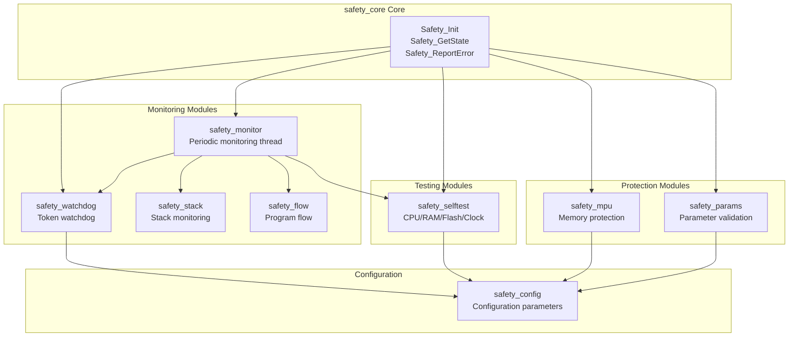

# Safety Modules Documentation

**Project**: TKX_ThreadX
**Version**: 1.0.1
**Module**: Safety Framework

---

This document describes the design and API of safety modules within the functional safety framework.

## Safety Module Architecture



## Module Overview

| Module | Files | Functionality |
|------|------|------|
| safety_core | safety_core.h/c | Safety core, state machine, error handling |
| safety_config | safety_config.h | Safety configuration parameters |
| safety_monitor | safety_monitor.h/c | Safety monitoring thread |
| safety_watchdog | safety_watchdog.h/c | Multi-thread token watchdog |
| safety_selftest | safety_selftest.h/c | Startup/runtime self-test |
| safety_stack | safety_stack.h/c | Thread stack monitoring |
| safety_flow | safety_flow.h/c | Program flow monitoring |
| safety_mpu | safety_mpu.h/c | MPU memory protection |

---

## 1. Safety Core

### Overview

The safety core module is the central hub of the entire safety framework, responsible for:
- Safety state machine management
- Error reporting and logging
- Initialization coordination
- Fault handling callbacks

### Data Types

```c
/* Safety states */
typedef enum {
    SAFETY_STATE_INIT           = 0x00U,    /* Initialization */
    SAFETY_STATE_STARTUP_TEST   = 0x01U,    /* Startup self-test */
    SAFETY_STATE_NORMAL         = 0x02U,    /* Normal operation */
    SAFETY_STATE_DEGRADED       = 0x03U,    /* Degraded operation */
    SAFETY_STATE_SAFE           = 0x04U,    /* Safe stop */
    SAFETY_STATE_ERROR          = 0xFFU     /* Error state */
} safety_state_t;

/* Safety error codes */
typedef enum {
    SAFETY_ERR_NONE             = 0x00U,
    SAFETY_ERR_CPU_TEST         = 0x01U,
    SAFETY_ERR_RAM_TEST         = 0x02U,
    SAFETY_ERR_FLASH_CRC        = 0x03U,
    SAFETY_ERR_CLOCK            = 0x04U,
    SAFETY_ERR_WATCHDOG         = 0x05U,
    SAFETY_ERR_STACK_OVERFLOW   = 0x06U,
    SAFETY_ERR_FLOW_MONITOR     = 0x07U,
    SAFETY_ERR_PARAM_INVALID    = 0x08U,
    SAFETY_ERR_RUNTIME_TEST     = 0x09U,
    SAFETY_ERR_MPU_FAULT        = 0x0AU,
    SAFETY_ERR_HARDFAULT        = 0x0BU,
    SAFETY_ERR_BUSFAULT         = 0x0CU,
    SAFETY_ERR_USAGEFAULT       = 0x0DU,
    SAFETY_ERR_NMI              = 0x0EU,
    SAFETY_ERR_INTERNAL         = 0xFFU
} safety_error_t;
```

### Core API

| Function | Description |
|------|------|
| `Safety_EarlyInit()` | Called before HAL initialization |
| `Safety_PostClockInit()` | Called after clock configuration |
| `Safety_PeripheralInit()` | Called after peripheral initialization |
| `Safety_StartupTest()` | Execute startup self-test |
| `Safety_PreKernelInit()` | Called before ThreadX startup |

### State Management API

| Function | Description |
|------|------|
| `Safety_GetState()` | Get current safety state |
| `Safety_SetState()` | Set safety state |
| `Safety_EnterNormal()` | Enter normal mode |
| `Safety_EnterDegraded()` | Enter degraded mode |
| `Safety_EnterSafeState()` | Enter safe stop |
| `Safety_IsOperational()` | Check if operational |

### Error Handling API

| Function | Description |
|------|------|
| `Safety_ReportError()` | Report safety error |
| `Safety_GetLastError()` | Get last error |
| `Safety_GetErrorCount()` | Get error count |
| `Safety_ClearError()` | Clear error status |
| `Safety_GetErrorLog()` | Get error log |

### Usage Example

```c
/* Initialization sequence in main.c */
int main(void)
{
    /* 1. Early initialization */
    Safety_EarlyInit();

    /* 2. HAL initialization */
    HAL_Init();

    /* 3. Clock configuration */
    SystemClock_Config();
    Safety_PostClockInit();

    /* 4. Peripheral initialization */
    MX_GPIO_Init();
    MX_CRC_Init();
    // ...

    /* 5. Startup self-test */
    if (Safety_StartupTest() != SAFETY_OK)
    {
        /* Handle self-test failure */
    }

    /* 6. Start ThreadX */
    MX_ThreadX_Init();
}
```

---

## 2. Safety Monitor

### Overview

The safety monitor thread is the highest priority thread, periodically executing the following tasks:
- Check watchdog tokens and feed watchdog
- Monitor thread stack usage
- Verify program flow signatures
- Execute incremental Flash CRC

### Configuration Parameters

```c
#define SAFETY_THREAD_STACK_SIZE    2048U   /* Stack size */
#define SAFETY_THREAD_PRIORITY      1U      /* Highest priority */
#define SAFETY_MONITOR_PERIOD_MS    100U    /* Period 100ms */
```

### API

| Function | Description |
|------|------|
| `Safety_Monitor_Init()` | Initialize and create thread |
| `Safety_Monitor_ThreadEntry()` | Thread entry function |
| `Safety_Monitor_GetStats()` | Get statistics |
| `Safety_Monitor_GetThread()` | Get thread handle |
| `Safety_Monitor_Signal()` | Trigger immediate execution |

### Thread Execution Flow

```c
void Safety_Monitor_ThreadEntry(ULONG thread_input)
{
    while (1)
    {
        /* 1. Record flow checkpoint */
        Safety_Flow_Checkpoint(PFM_CP_APP_SAFETY_MONITOR);

        /* 2. Check watchdog tokens */
        Safety_Watchdog_Process();

        /* 3. Check thread stacks */
        Safety_Stack_CheckAll();

        /* 4. Verify program flow */
        Safety_Flow_Verify();

        /* 5. Incremental Flash CRC */
        Safety_SelfTest_FlashCRC_Continue();

        /* 6. Wait for next period */
        tx_thread_sleep(SAFETY_MONITOR_PERIOD_MS / 10);
    }
}
```

---

## 3. Safety Watchdog

### Overview

Token-based multi-thread watchdog mechanism:
- Each critical thread must report tokens periodically
- Watchdog is fed only when all tokens are collected
- Any stuck thread will cause watchdog reset

### Token Definitions

```c
#define WDG_TOKEN_SAFETY_THREAD     0x01U
#define WDG_TOKEN_MAIN_THREAD       0x02U
#define WDG_TOKEN_COMM_THREAD       0x04U
#define WDG_TOKEN_ALL               0x07U
```

### API

| Function | Description |
|------|------|
| `Safety_Watchdog_Init()` | Initialize watchdog management |
| `Safety_Watchdog_Start()` | Start IWDG |
| `Safety_Watchdog_ReportToken()` | Report thread token |
| `Safety_Watchdog_CheckAllTokens()` | Check token integrity |
| `Safety_Watchdog_Process()` | Periodic processing |
| `Safety_Watchdog_EnterDegraded()` | Enter degraded mode |
| `Safety_Watchdog_GetStatus()` | Get status |

### Usage Example

```c
/* In application thread */
void App_MainThreadEntry(ULONG thread_input)
{
    while (1)
    {
        /* Business logic */
        ProcessBusinessLogic();

        /* Report watchdog token */
        Safety_Watchdog_ReportToken(WDG_TOKEN_MAIN_THREAD);

        tx_thread_sleep(10);
    }
}
```

### Timing Requirements

```mermaid
gantt
    title Watchdog Timing
    dateFormat X
    axisFormat %Lms

    section IWDG
    IWDG Period     :a1, 0, 1000

    section Token
    Token Validity  :b1, 0, 800

    section Feed
    First Feed      :milestone, m1, 0, 0
    Second Feed     :milestone, m2, 500, 0
```



**ASCII Version:**
```
IWDG Timeout: 1000ms
Token Timeout: 800ms
Feed Period: 500ms

Timing Diagram:
0ms      500ms    1000ms
|--------|--------|
    Feed     Feed

Each thread must report token within 800ms
```

---

## 4. Safety SelfTest

### Overview

Provides startup and runtime self-test functionality:
- Startup: Complete CPU/RAM/Flash/Clock testing
- Runtime: Incremental Flash CRC verification

### Test Results

```c
typedef enum {
    SELFTEST_PASS           = 0x00U,
    SELFTEST_FAIL_CPU       = 0x01U,
    SELFTEST_FAIL_RAM       = 0x02U,
    SELFTEST_FAIL_FLASH     = 0x03U,
    SELFTEST_FAIL_CLOCK     = 0x04U,
    SELFTEST_FAIL_CRC       = 0x05U,
    SELFTEST_IN_PROGRESS    = 0xFEU,
    SELFTEST_NOT_RUN        = 0xFFU
} selftest_result_t;
```

### API

| Function | Description |
|------|------|
| `Safety_SelfTest_Init()` | Initialize |
| `Safety_SelfTest_RunStartup()` | Run startup self-test |
| `Safety_SelfTest_CPU()` | CPU register test |
| `Safety_SelfTest_RAM()` | RAM test |
| `Safety_SelfTest_FlashCRC()` | Flash CRC test |
| `Safety_SelfTest_FlashCRC_Continue()` | Incremental CRC continue |
| `Safety_SelfTest_Clock()` | Clock verification |

### Incremental Flash CRC

```c
#define SELFTEST_FLASH_CRC_INTERVAL_MS  300000U  /* 5 minutes full cycle */
#define SELFTEST_FLASH_CRC_BLOCK_SIZE   4096U    /* 4KB per iteration */

/* Application size 448KB, 4KB per iteration:
 * 448KB / 4KB = 112 iterations
 * 5 minutes / 112 = approximately 2.7 seconds/iteration
 */
```

---

## 5. Safety Stack

### Overview

Monitors ThreadX thread stack usage:
- Utilizes ThreadX stack fill pattern to detect usage
- Sets warning and critical thresholds
- Detects stack overflow

### Configuration Parameters

```c
#define STACK_CHECK_INTERVAL_MS     100U        /* Check period */
#define STACK_WARNING_THRESHOLD     70U         /* 70% warning */
#define STACK_CRITICAL_THRESHOLD    90U         /* 90% critical */
#define STACK_FILL_PATTERN          0xEFEFEFEFU /* Fill pattern */
```

### API

| Function | Description |
|------|------|
| `Safety_Stack_Init()` | Initialize |
| `Safety_Stack_RegisterThread()` | Register thread |
| `Safety_Stack_UnregisterThread()` | Unregister thread |
| `Safety_Stack_CheckAll()` | Check all threads |
| `Safety_Stack_GetInfo()` | Get thread stack info |

### Usage Example

```c
/* Register after creating thread */
tx_thread_create(&my_thread, ...);
Safety_Stack_RegisterThread(&my_thread);
```

### Stack Info Structure

```c
typedef struct {
    TX_THREAD   *thread;
    const char  *name;
    ULONG       stack_size;
    ULONG       stack_used;
    ULONG       stack_available;
    ULONG       stack_highest;      /* Historical highest */
    uint8_t     usage_percent;
    bool        warning;            /* >= 70% */
    bool        critical;           /* >= 90% */
} stack_info_t;
```

---

## 6. Safety Flow

### Overview

Monitors program execution flow using signature accumulation:
- Records checkpoints at critical locations
- Accumulates signature values
- Periodically verifies signature correctness

### Checkpoint Definitions

```c
/* Application checkpoints */
#define PFM_CP_APP_INIT             0x10U
#define PFM_CP_APP_SAFETY_MONITOR   0x11U
#define PFM_CP_APP_WATCHDOG_FEED    0x12U
#define PFM_CP_APP_SELFTEST_START   0x13U
#define PFM_CP_APP_SELFTEST_END     0x14U
#define PFM_CP_APP_MAIN_LOOP        0x15U
#define PFM_CP_APP_COMM_HANDLER     0x16U
#define PFM_CP_APP_PARAM_CHECK      0x17U
```

### API

| Function | Description |
|------|------|
| `Safety_Flow_Init()` | Initialize |
| `Safety_Flow_Checkpoint()` | Record checkpoint |
| `Safety_Flow_Verify()` | Verify signature |
| `Safety_Flow_Reset()` | Reset signature |
| `Safety_Flow_GetSignature()` | Get current signature |
| `Safety_Flow_SetExpected()` | Set expected signature |

### Usage Example

```c
void App_MainLoop(void)
{
    /* Record loop entry checkpoint */
    Safety_Flow_Checkpoint(PFM_CP_APP_MAIN_LOOP);

    /* Business processing */
    ProcessData();

    /* Communication handling */
    Safety_Flow_Checkpoint(PFM_CP_APP_COMM_HANDLER);
    HandleCommunication();
}
```

---

## 7. Safety MPU

### Overview

Configures Cortex-M4 MPU for memory protection:
- Prevents illegal memory access
- Protects Flash from accidental writes
- Isolates Bootloader region

### Region Configuration

| Region | Address | Size | Permissions | Purpose |
|--------|------|------|------|------|
| 0 | 0x08010000 | 512KB | RO+X | App Flash |
| 1 | 0x20000000 | 128KB | RW | Main RAM |
| 2 | 0x10000000 | 64KB | RW | CCM RAM |
| 3 | 0x40000000 | 512MB | RW+Device | Peripherals |
| 4 | 0x0800C000 | 16KB | RO | Config Flash |
| 5 | 0x08000000 | 64KB | No Access | Bootloader |

### API

| Function | Description |
|------|------|
| `Safety_MPU_Init()` | Initialize MPU |
| `Safety_MPU_ConfigRegion()` | Configure single region |
| `Safety_MPU_Enable()` | Enable MPU |
| `Safety_MPU_Disable()` | Disable MPU |
| `Safety_MPU_IsEnabled()` | Check if enabled |
| `Safety_MPU_GetRegion()` | Get region configuration |

### Fault Handling

MPU access violations trigger MemManage exception:

```c
void Safety_MemManageHandler(void)
{
    uint32_t mmfar = SCB->MMFAR;    /* Fault address */
    uint32_t cfsr = SCB->CFSR;      /* Fault status */

    Safety_LogError(SAFETY_ERR_MPU_FAULT, mmfar, cfsr);
    Safety_EnterSafeState(SAFETY_ERR_MPU_FAULT);
}
```

---

## Error Handling Strategy

### Error Classification

| Error Type | Handling Method | Examples |
|----------|----------|------|
| Fatal Error | Enter safe stop | RAM/Flash corruption |
| Severe Error | Enter degraded mode | Invalid parameters |
| Warning | Log and continue | High stack usage |

### Error Log

```c
typedef struct {
    uint32_t timestamp;     /* Occurrence time */
    uint32_t error_code;    /* Error code */
    uint32_t param1;        /* Parameter 1 */
    uint32_t param2;        /* Parameter 2 */
} safety_error_log_t;

#define ERROR_LOG_MAX_ENTRIES   16
```

---

## Configuration Summary

### Timing Parameters

| Parameter | Value | Description |
|------|-----|------|
| `SAFETY_MONITOR_PERIOD_MS` | 100ms | Safety thread period |
| `WDG_FEED_PERIOD_MS` | 500ms | Watchdog feed period |
| `WDG_TOKEN_TIMEOUT_MS` | 800ms | Token timeout |
| `IWDG_TIMEOUT_MS` | 1000ms | IWDG timeout |
| `FLASH_CRC_CHECK_INTERVAL_MS` | 300000ms | Flash CRC period |
| `STACK_CHECK_INTERVAL_MS` | 100ms | Stack check period |
| `FLOW_VERIFY_INTERVAL_MS` | 1000ms | Flow verification period |

### Threshold Parameters

| Parameter | Value | Description |
|------|-----|------|
| `STACK_WARNING_THRESHOLD` | 70% | Stack warning threshold |
| `STACK_CRITICAL_THRESHOLD` | 90% | Stack critical threshold |
| `CLOCK_TOLERANCE_PERCENT` | 5% | Clock error tolerance |
| `SELFTEST_FLASH_CRC_BLOCK_SIZE` | 4KB | Flash CRC block size |

---

## 8. Safety Params

### Overview

The parameter validation module is responsible for:
- Validating safety parameter structure integrity
- Checking parameter range validity
- Verifying redundant copy consistency
- Periodic parameter integrity checking

### Validation Results

```c
typedef enum {
    PARAMS_VALID            = 0x00U,    /* Parameters valid */
    PARAMS_ERR_MAGIC        = 0x01U,    /* Invalid magic number */
    PARAMS_ERR_VERSION      = 0x02U,    /* Version mismatch */
    PARAMS_ERR_SIZE         = 0x03U,    /* Size mismatch */
    PARAMS_ERR_CRC          = 0x04U,    /* CRC error */
    PARAMS_ERR_HALL_RANGE   = 0x05U,    /* HALL parameter out of range */
    PARAMS_ERR_ADC_RANGE    = 0x06U,    /* ADC parameter out of range */
    PARAMS_ERR_THRESHOLD    = 0x07U,    /* Threshold out of range */
    PARAMS_ERR_REDUNDANCY   = 0x08U,    /* Redundancy check failed */
} params_result_t;
```

### API

| Function | Description |
|------|------|
| `Safety_Params_Init()` | Initialize module |
| `Safety_Params_Validate()` | Validate parameter structure |
| `Safety_Params_ValidateFlash()` | Validate parameters in Flash |
| `Safety_Params_Get()` | Get validated parameters |
| `Safety_Params_IsValid()` | Check parameter validity |
| `Safety_Params_PeriodicCheck()` | Periodic integrity check |

### Validation Flow

```
1. Validate header (magic, version, size)
2. Validate CRC32
3. Validate HALL parameter ranges
4. Validate ADC parameter ranges
5. Validate safety threshold ranges
6. Validate redundant copy (bit inversion)
```

### Parameter Range Definitions

```c
#define HALL_OFFSET_MIN         (-1000.0f)
#define HALL_OFFSET_MAX         (1000.0f)
#define HALL_GAIN_MIN           (0.5f)
#define HALL_GAIN_MAX           (2.0f)
#define ADC_GAIN_MIN            (0.8f)
#define ADC_GAIN_MAX            (1.2f)
```

---

## 9. Dual Watchdog (IWDG + WWDG)

### Overview

Dual-channel watchdog provides higher reliability:
- **IWDG**: Independent watchdog, uses LSI clock
- **WWDG**: Window watchdog, uses PCLK1 clock

### Configuration

```c
/* WWDG enable/disable */
#define WWDG_ENABLED            0   /* Set to 1 after configuring in CubeMX */

/* WWDG timing parameters */
#define WWDG_PRESCALER          8U
#define WWDG_WINDOW             0x50U   /* Window value */
#define WWDG_COUNTER            0x7FU   /* Counter value */
```

### API (WWDG Extension)

| Function | Description |
|------|------|
| `Safety_Watchdog_StartWWDG()` | Start WWDG |
| `Safety_Watchdog_FeedWWDG()` | Feed WWDG |
| `Safety_Watchdog_WWDG_IRQHandler()` | WWDG early wakeup interrupt |

### Dual Watchdog Advantages

| Feature | IWDG | WWDG |
|------|------|------|
| Clock Source | LSI (independent) | PCLK1 (system) |
| Reset Condition | Timeout | Timeout or premature feed |
| Detection Capability | Deadlock detection | Timing anomaly detection |
| Precision | Low | High |

---

## 10. Diagnostic Output (RTT/SystemView)

### Segger RTT Diagnostics

RTT provides real-time debug output without occupying GPIO:

```c
/* bsp_debug.h */
#define DEBUG_INFO(fmt, ...)    SEGGER_RTT_printf(0, "[INF] " fmt "\r\n", ##__VA_ARGS__)
#define DEBUG_WARN(fmt, ...)    SEGGER_RTT_printf(0, "[WRN] " fmt "\r\n", ##__VA_ARGS__)
#define DEBUG_ERROR(fmt, ...)   SEGGER_RTT_printf(0, "[ERR] " fmt "\r\n", ##__VA_ARGS__)
```

### SystemView ThreadX Tracing

SystemView provides RTOS visualization analysis:

```c
/* bsp_sysview.h */
#define SYSVIEW_ENABLED         0   /* Set to 1 to enable */

/* Initialization */
BSP_SysView_Init();

/* Custom event recording */
BSP_SysView_RecordEvent(0, "Safety check passed");
BSP_SysView_RecordValue(1, temperature);
```

### Tools

| Tool | Purpose |
|------|------|
| J-Link RTT Viewer | View RTT debug output |
| Segger SystemView | Visualize ThreadX threads/interrupts |

---

## Safety Development Process

### 1. Code Style Guidelines

```c
/**
 ******************************************************************************
 * @file    safety_xxx.h
 * @brief   Module Description
 * @author  YCX81
 * @version V1.0.0
 ******************************************************************************
 */

/* Section delimiter */
/* ============================================================================
 * Section Name
 * ============================================================================*/

/* Static variable prefix */
static xxx_t s_variable_name;

/* Function naming */
safety_status_t Safety_Module_Function(void);
```

### 2. IEC 61508 SIL 2 Compliance Checklist

| Item | Status | Description |
|------|------|------|
| CPU Self-test | ✓ | Register pattern test |
| RAM Self-test | ✓ | March C algorithm |
| Flash CRC | ✓ | Startup + incremental verification |
| Clock Monitoring | ✓ | Frequency range check |
| Watchdog | ✓ | Token mechanism + optional dual channel |
| Stack Monitoring | ✓ | ThreadX integration |
| Program Flow | ✓ | Signature accumulation |
| MPU Protection | ✓ | 6 region configuration |
| Parameter Validation | ✓ | CRC + range + redundancy |
| Error Logging | ✓ | Circular buffer |
| Diagnostic Output | ✓ | RTT + SystemView |

### 3. Pending Items

- [ ] Formal FMEA documentation
- [ ] Fault injection test cases
- [ ] Code coverage analysis
- [ ] Assembly-level CPU test (optional)
