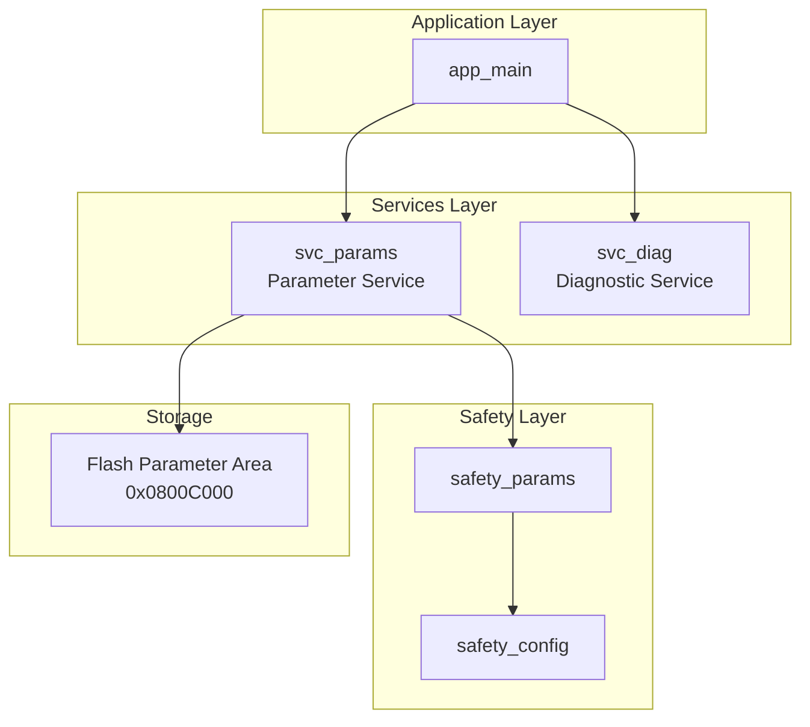
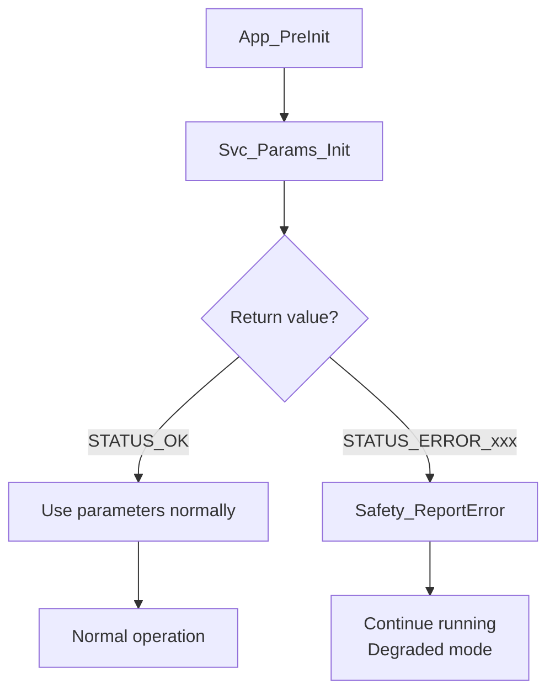

# Services Layer Documentation

**Project**: TKX_ThreadX
**Version**: 1.0.1
**Module**: Services Layer

---

## Overview

The services layer sits above the safety layer and below the application layer, providing access interfaces to safety parameters and system configuration.

### Services Layer Architecture



## Module List

| Module | Files | Function |
|--------|-------|----------|
| svc_params | svc_params.h/c | Parameter service |

---

## Parameter Service (svc_params)

### Features

- Read safety parameters and boot configuration from Flash
- Validate parameter integrity (Magic, CRC, Redundancy)
- Validate parameter ranges
- Provide parameter access interface

### Parameter Storage Locations

| Parameter Type | Flash Address | Size |
|----------------|---------------|------|
| boot_config_t | 0x0800C000 | 36 bytes |
| safety_params_t | After boot_config | 168 bytes |

### Parameter Structures

#### boot_config_t

```c
typedef struct __attribute__((packed)) {
    uint32_t magic;         /* 0xC0F16000 */
    uint32_t factory_mode;  /* Factory mode flag */
    uint32_t cal_valid;     /* Calibration data valid */
    uint32_t app_crc;       /* Application CRC */
    uint32_t boot_count;    /* Boot counter */
    uint32_t last_error;    /* Last error */
    uint32_t reserved[2];   /* Reserved */
    uint32_t crc;           /* Structure CRC32 */
} boot_config_t;
```

#### safety_params_t

```c
typedef struct __attribute__((packed)) {
    /* Header */
    uint32_t magic;             /* 0xCA11B000 */
    uint16_t version;           /* Version 0x0100 */
    uint16_t size;              /* Structure size */

    /* HALL sensor calibration */
    float hall_offset[3];       /* HALL offset */
    float hall_gain[3];         /* HALL gain */
    float hall_offset_inv[3];   /* Offset inverse */
    float hall_gain_inv[3];     /* Gain inverse */

    /* ADC calibration */
    float adc_gain[8];          /* ADC gain */
    float adc_offset[8];        /* ADC offset */

    /* Safety thresholds */
    float safety_threshold[4];

    /* Reserved */
    uint32_t reserved[7];

    /* CRC */
    uint32_t crc32;
} safety_params_t;
```

### API Reference

#### Svc_Params_Init

```c
shared_status_t Svc_Params_Init(void);
```

Initialize parameter service, read parameters from Flash and validate.

**Return Values**:
- `STATUS_OK` - Initialization successful, parameters valid
- `STATUS_ERROR_MAGIC` - Magic validation failed
- `STATUS_ERROR_CRC` - CRC check failed
- `STATUS_ERROR_REDUNDANCY` - Redundancy check failed
- `STATUS_ERROR_RANGE` - Parameter out of range

**Usage Example**:
```c
if (Svc_Params_Init() != STATUS_OK)
{
    /* Parameters invalid, report error */
    Safety_ReportError(SAFETY_ERR_PARAM_INVALID, 0, 0);
}
```

#### Svc_Params_Validate

```c
shared_status_t Svc_Params_Validate(void);
```

Re-validate loaded parameters.

**Validation Steps**:
1. Check Magic Number
2. Validate CRC32
3. Validate redundancy fields (bit inversion)
4. Check parameter ranges

#### Svc_Params_IsValid

```c
bool Svc_Params_IsValid(void);
```

Check if parameters are valid.

**Return Value**: `true` if parameters have passed all validations

#### Svc_Params_GetSafety

```c
const safety_params_t* Svc_Params_GetSafety(void);
```

Get read-only pointer to safety parameters.

**Return Value**: Parameter pointer, or `NULL` if invalid

#### Svc_Params_GetBootConfig

```c
const boot_config_t* Svc_Params_GetBootConfig(void);
```

Get read-only pointer to boot configuration.

**Return Value**: Configuration pointer, or `NULL` if not initialized

### Parameter Access Functions

| Function | Parameter | Return Value | Default Value |
|----------|-----------|--------------|---------------|
| `Svc_Params_GetHallOffset()` | channel (0-2) | float | 0.0 |
| `Svc_Params_GetHallGain()` | channel (0-2) | float | 1.0 |
| `Svc_Params_GetAdcGain()` | channel (0-7) | float | 1.0 |
| `Svc_Params_GetAdcOffset()` | channel (0-7) | float | 0.0 |
| `Svc_Params_GetSafetyThreshold()` | index (0-3) | float | 0.0 |

**Note**: If parameters are invalid or channel is out of range, default values are returned.

### Parameter Range Validation

| Parameter | Minimum | Maximum |
|-----------|---------|---------|
| hall_offset | -1000.0 | 1000.0 |
| hall_gain | 0.5 | 2.0 |
| adc_gain | 0.8 | 1.2 |
| adc_offset | -500.0 | 500.0 |
| safety_threshold | 0.0 | 10000.0 |

### Redundancy Check

Safety parameters use bit inversion redundancy storage for critical parameters:

```c
/* Validate redundancy */
static shared_status_t ValidateRedundancy(void)
{
    for (int i = 0; i < 3; i++)
    {
        uint32_t val, val_inv;

        /* Get original value and inverse */
        memcpy(&val, &params.hall_offset[i], sizeof(uint32_t));
        memcpy(&val_inv, &params.hall_offset_inv[i], sizeof(uint32_t));

        /* Verify: val == ~val_inv */
        if (val != ~val_inv)
        {
            return STATUS_ERROR_REDUNDANCY;
        }
    }
    return STATUS_OK;
}
```

### Usage Flow



### Integration with Safety Module

Parameter service is initialized in `App_PreInit()`:

```c
shared_status_t App_PreInit(void)
{
    shared_status_t status;

    /* Initialize parameter service */
    status = Svc_Params_Init();
    if (status != STATUS_OK)
    {
        /* Parameters invalid - report error but continue */
        Safety_ReportError(SAFETY_ERR_PARAM_INVALID, status, 0);
    }

    return STATUS_OK;
}
```

Application uses parameters:

```c
void ProcessSensorData(void)
{
    /* Check parameter validity */
    if (!Svc_Params_IsValid())
    {
        /* Use default values or refuse to process */
        return;
    }

    /* Apply calibration parameters */
    for (int i = 0; i < 3; i++)
    {
        float offset = Svc_Params_GetHallOffset(i);
        float gain = Svc_Params_GetHallGain(i);

        calibrated_value[i] = (raw_value[i] - offset) * gain;
    }
}
```

### Parameter Programming

Parameters need to be programmed to Config Flash via debugger or dedicated tool:

1. **Prepare parameter data**
   - Fill safety_params_t structure
   - Calculate redundancy values (`~original_value`)
   - Calculate CRC32

2. **Programming procedure**
   - Unlock Flash
   - Erase Sector 3 (0x0800C000)
   - Write boot_config_t
   - Write safety_params_t
   - Lock Flash

3. **Verification**
   - Reset system
   - Check that `Svc_Params_IsValid()` returns true

### Error Handling

| Error Code | Meaning | Handling |
|------------|---------|----------|
| STATUS_ERROR_MAGIC | Magic mismatch | Parameters not programmed or corrupted |
| STATUS_ERROR_CRC | CRC mismatch | Data corrupted |
| STATUS_ERROR_REDUNDANCY | Redundancy check failed | Bit flip error |
| STATUS_ERROR_RANGE | Parameter out of range | Parameter value abnormal |

All errors should cause the system to enter degraded mode or use default parameters.
