# 架构设计 / Architecture Design

**项目 / Project**: TKX_ThreadX
**合规标准 / Compliance**: IEC 61508 SIL 2 / ISO 13849 PL d
**版本 / Version**: 1.0.0

> 本文档使用 Mermaid.js 绘制架构图，可在 GitHub、VS Code (Markdown Preview Mermaid) 或其他支持 Mermaid 的工具中查看。

---

## 目录 / Table of Contents

1. [系统架构概览](#1-系统架构概览)
2. [分层职责](#2-分层职责)
3. [内存布局详解](#3-内存布局详解)
4. [线程架构](#4-线程架构)
5. [初始化时序](#5-初始化时序)
6. [安全状态机](#6-安全状态机)
7. [模块依赖关系](#7-模块依赖关系)
8. [设计决策](#8-设计决策)
9. [CI/CD 流程](#9-cicd-流程)

---

## 1. 系统架构概览

### 1.1 硬件架构 / Hardware Architecture

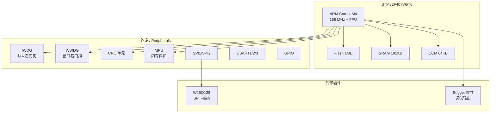

### 1.2 系统组件关系 / System Component Relations

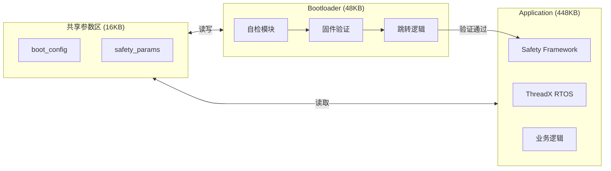

### 1.3 软件分层架构 (ASCII)

```
┌─────────────────────────────────────────────────────────────────┐
│                      Application Layer                          │
│  ┌─────────────┐  ┌─────────────┐  ┌─────────────┐              │
│  │ Main Thread │  │ Comm Thread │  │ Other Tasks │              │
│  └─────────────┘  └─────────────┘  └─────────────┘              │
├─────────────────────────────────────────────────────────────────┤
│                       Services Layer                             │
│  ┌─────────────┐  ┌─────────────┐  ┌─────────────┐              │
│  │ Param Svc   │  │ Diag Svc    │  │ Comm Svc    │              │
│  └─────────────┘  └─────────────┘  └─────────────┘              │
├─────────────────────────────────────────────────────────────────┤
│                       Safety Layer                               │
│  ┌──────────┐ ┌──────────┐ ┌──────────┐ ┌──────────┐            │
│  │ Core     │ │ Watchdog │ │ Stack    │ │ Flow     │            │
│  ├──────────┤ ├──────────┤ ├──────────┤ ├──────────┤            │
│  │ Monitor  │ │ SelfTest │ │ MPU      │ │ Config   │            │
│  └──────────┘ └──────────┘ └──────────┘ └──────────┘            │
├─────────────────────────────────────────────────────────────────┤
│                    Azure RTOS ThreadX                            │
├─────────────────────────────────────────────────────────────────┤
│                    STM32 HAL Driver                              │
├─────────────────────────────────────────────────────────────────┤
│                    Hardware (STM32F407)                          │
└─────────────────────────────────────────────────────────────────┘
```

---

## 2. 分层职责

### 2.1 六层架构 / Six-Layer Architecture

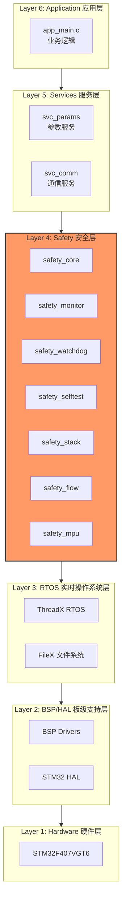

### 2.2 各层职责

| 层级 | 名称 | 职责 |
|------|------|------|
| **Hardware Layer** | 硬件层 | STM32F407VGT6 MCU、外设：CRC, IWDG, WWDG, MPU, Flash, GPIO |
| **HAL Layer** | 驱动层 | STM32Cube HAL 驱动、硬件抽象，提供统一 API |
| **RTOS Layer** | 系统层 | Azure RTOS ThreadX 6.1.10、多线程调度、同步原语、内存管理 |
| **Safety Layer** | 安全层 | 功能安全核心模块、自检、监控、保护机制 |
| **Services Layer** | 服务层 | 参数管理服务、诊断服务 |
| **Application Layer** | 应用层 | 业务逻辑实现、应用线程 |

---

## 3. 内存布局详解

### 3.1 Flash 分区

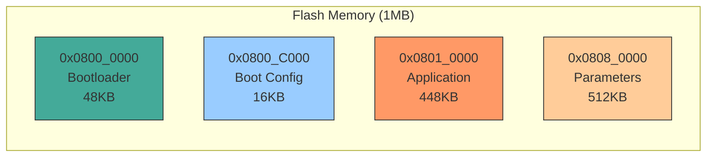

**Flash 分区 (ASCII)**:
```
┌───────────────────────────┐ 0x08080000
│                           │
│      Reserved (512KB)     │
│                           │
├───────────────────────────┤ 0x08010000
│                           │
│    Application (448KB)    │
│    Sectors 4-7            │
│                           │
├───────────────────────────┤ 0x0800C000
│   Config/Calibration      │
│        (16KB)             │
│      Sector 3             │
├───────────────────────────┤ 0x08000000
│    Bootloader (48KB)      │
│    Sectors 0-2            │
└───────────────────────────┘
```

### 3.2 RAM 分区

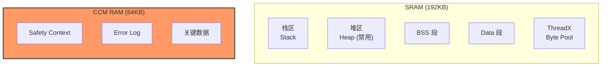

**RAM 分区 (ASCII)**:
```
┌───────────────────────────┐ 0x20020000
│   RAM Test Area (32KB)    │
│   (Startup test only)     │
├───────────────────────────┤ 0x20018000
│                           │
│   Application Data        │
│        (96KB)             │
│                           │
└───────────────────────────┘ 0x20000000

┌───────────────────────────┐ 0x10010000
│                           │
│   CCM RAM (64KB)          │
│   - Thread Stacks         │
│   - Error Logs            │
│   - Critical Data         │
│                           │
└───────────────────────────┘ 0x10000000
```

### 3.3 MPU 保护配置

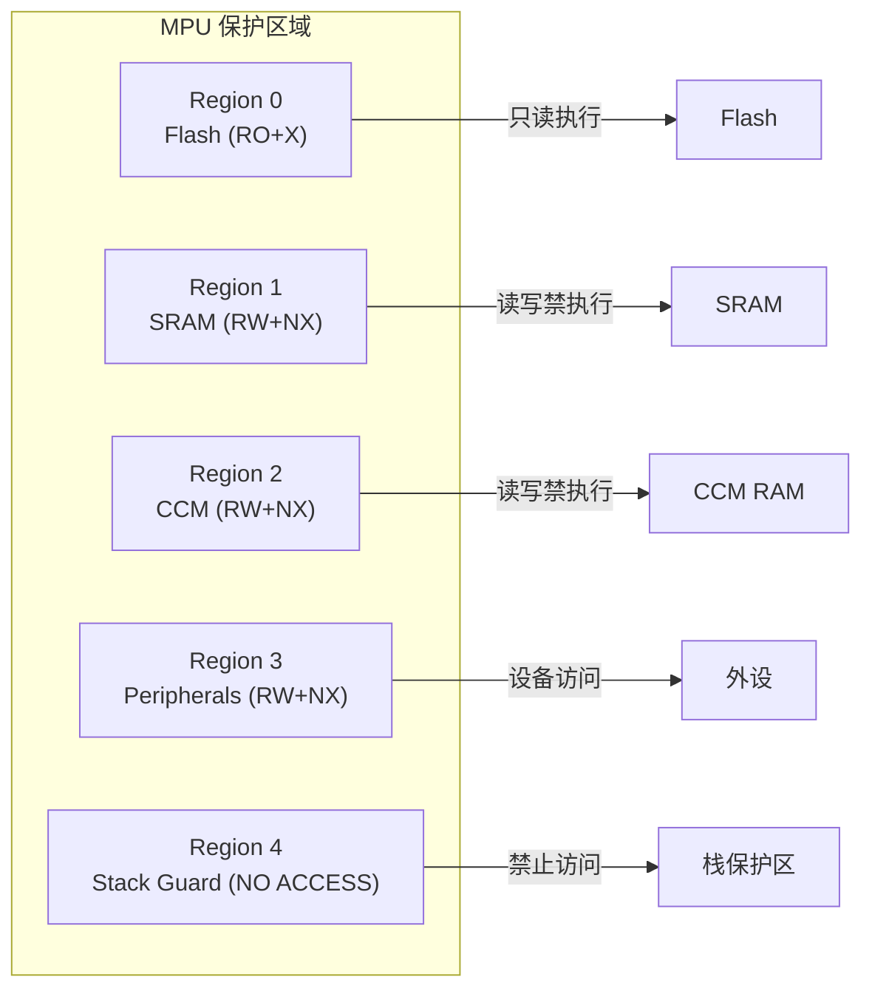

| Region | 起始地址 | 大小 | 权限 | 用途 |
|--------|----------|------|------|------|
| 0 | 0x08010000 | 512KB | RO+X | Application Flash |
| 1 | 0x20000000 | 128KB | RW | Main RAM |
| 2 | 0x10000000 | 64KB | RW | CCM RAM (Stacks) |
| 3 | 0x40000000 | 512MB | RW+Device | Peripherals |
| 4 | 0x0800C000 | 16KB | RO | Config Flash |
| 5 | 0x08000000 | 64KB | No Access | Bootloader (Protect) |

---

## 4. 线程架构

### 4.1 线程优先级

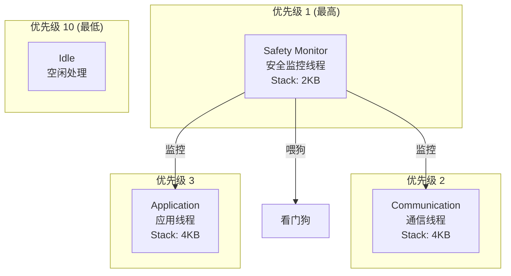

| 线程 | 优先级 | 栈大小 | 周期 | 职责 |
|------|--------|--------|------|------|
| Safety Monitor | 1 (最高) | 2KB | 100ms | 安全监控 |
| App Main | 5 | 4KB | 10ms | 主业务逻辑 |
| App Comm | 10 | 2KB | 事件驱动 | 通信处理 |

### 4.2 线程交互

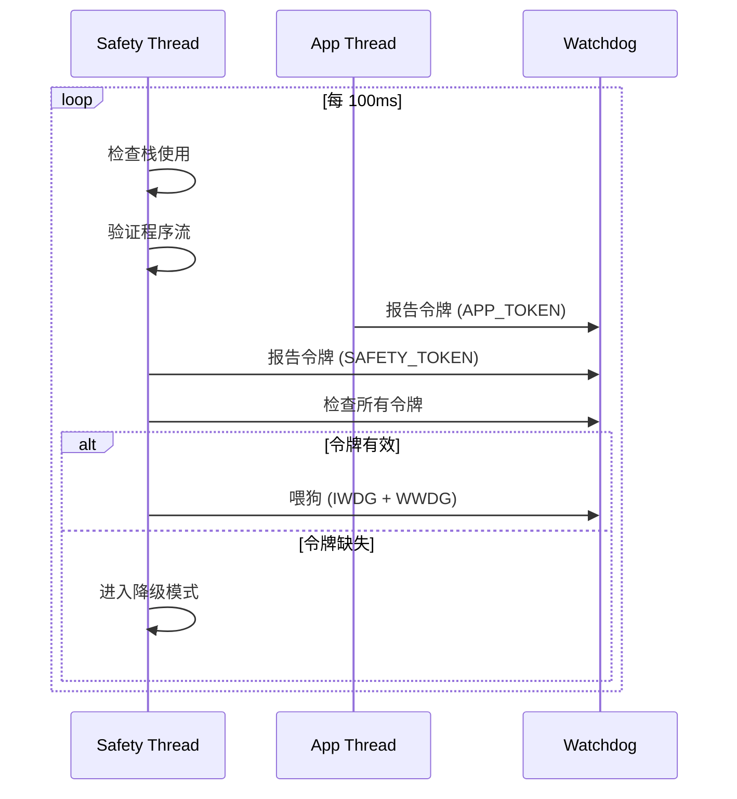

**线程交互 (ASCII)**:
```
┌─────────────────┐
│ Safety Monitor  │──────────────────────────────────┐
│   (Priority 1)  │                                  │
└────────┬────────┘                                  │
         │ Feed WDG                                  │
         │ Check Stacks                              │
         │ Verify Flow                               │
         ▼                                           │
┌─────────────────┐    ┌─────────────────┐          │
│   App Main      │◄───│   App Comm      │          │
│   (Priority 5)  │    │   (Priority 10) │          │
└────────┬────────┘    └────────┬────────┘          │
         │                      │                    │
         │ ReportToken()        │ ReportToken()      │
         │ Checkpoint()         │ Checkpoint()       │
         └──────────────────────┴────────────────────┘
```

---

## 5. 初始化时序

### 5.1 完整启动流程

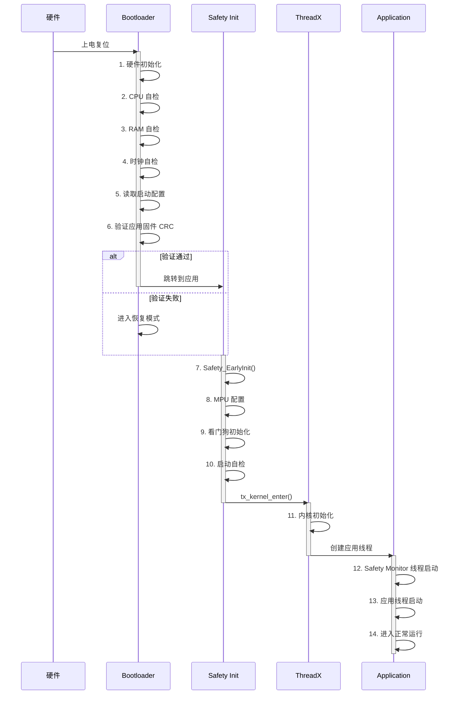

### 5.2 Bootloader 启动流程

```
Reset
  │
  ▼
┌─────────────────────────────┐
│ 1. Boot_SystemInit()        │ HAL + 时钟配置
└──────────────┬──────────────┘
               ▼
┌─────────────────────────────┐
│ 2. Boot_SelfTest()          │ CPU/RAM/Flash 自检
└──────────────┬──────────────┘
               ▼
┌─────────────────────────────┐
│ 3. Boot_ValidateSafetyParams│ 安全参数校验
└──────────────┬──────────────┘
               ▼
┌─────────────────────────────┐
│ 4. Boot_VerifyAppCRC()      │ 应用程序 CRC
└──────────────┬──────────────┘
               ▼
┌─────────────────────────────┐
│ 5. Boot_JumpToApplication() │ 跳转到应用
└─────────────────────────────┘
```

### 5.3 Application 启动流程

```
Entry (0x08010000)
  │
  ▼
┌─────────────────────────────┐
│ 1. Safety_EarlyInit()       │ 早期初始化
└──────────────┬──────────────┘
               ▼
┌─────────────────────────────┐
│ 2. HAL_Init()               │ HAL 初始化
└──────────────┬──────────────┘
               ▼
┌─────────────────────────────┐
│ 3. SystemClock_Config()     │ 时钟配置
└──────────────┬──────────────┘
               ▼
┌─────────────────────────────┐
│ 4. Safety_PostClockInit()   │ 时钟后初始化
└──────────────┬──────────────┘
               ▼
┌─────────────────────────────┐
│ 5. MX_xxx_Init()            │ 外设初始化
└──────────────┬──────────────┘
               ▼
┌─────────────────────────────┐
│ 6. Safety_StartupTest()     │ 启动自检
└──────────────┬──────────────┘
               ▼
┌─────────────────────────────┐
│ 7. MX_ThreadX_Init()        │ ThreadX 启动
└──────────────┬──────────────┘
               ▼
┌─────────────────────────────┐
│ 8. App_CreateThreads()      │ 创建应用线程
└──────────────┬──────────────┘
               ▼
       Kernel Running
```

### 5.4 自检流程 / Self-Test Flow

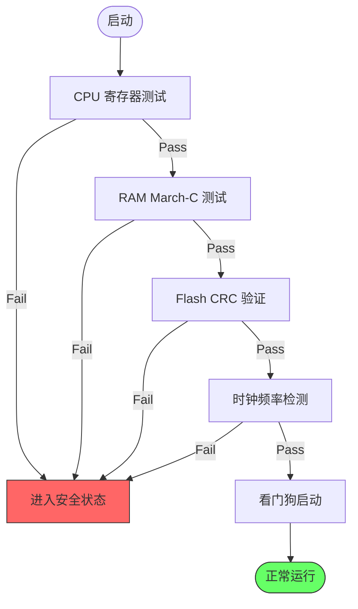

---

## 6. 安全状态机

### 6.1 安全状态机 / Safety State Machine

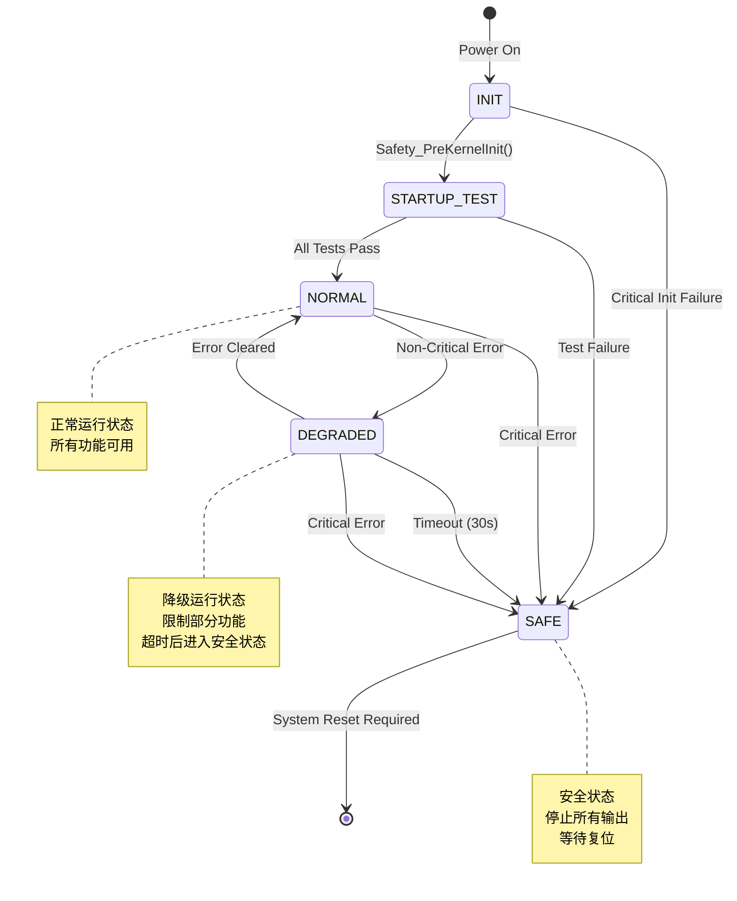

**安全状态机 (ASCII)**:
```
                    ┌───────────────┐
                    │     INIT      │
                    └───────┬───────┘
                            │ 自检开始
                            ▼
                    ┌───────────────┐
                    │ STARTUP_TEST  │
                    └───────┬───────┘
         自检失败           │ 自检通过
    ┌───────────────────────┼───────────────────────┐
    │                       ▼                       │
    │               ┌───────────────┐               │
    │               │    NORMAL     │◄──────────────┤
    │               └───────┬───────┘   恢复正常     │
    │                       │                       │
    │         非致命错误     │  致命错误              │
    │                       ▼                       │
    │               ┌───────────────┐               │
    │               │   DEGRADED    │───────────────┤
    │               └───────┬───────┘   超时         │
    │                       │ 致命错误              │
    │                       ▼                       │
    │               ┌───────────────┐               │
    └──────────────►│     SAFE      │◄──────────────┘
                    └───────────────┘
                            │
                            ▼
                    停止所有输出
                    等待看门狗复位
```

### 6.2 状态说明

| 状态 | 值 | 说明 |
|------|-----|------|
| INIT | 0x00 | 初始状态，系统启动 |
| STARTUP_TEST | 0x01 | 执行启动自检 |
| NORMAL | 0x02 | 正常运行状态 |
| DEGRADED | 0x03 | 降级运行，功能受限 |
| SAFE | 0x04 | 安全停止状态 |
| ERROR | 0xFF | 错误状态 |

### 6.3 Bootloader 状态机

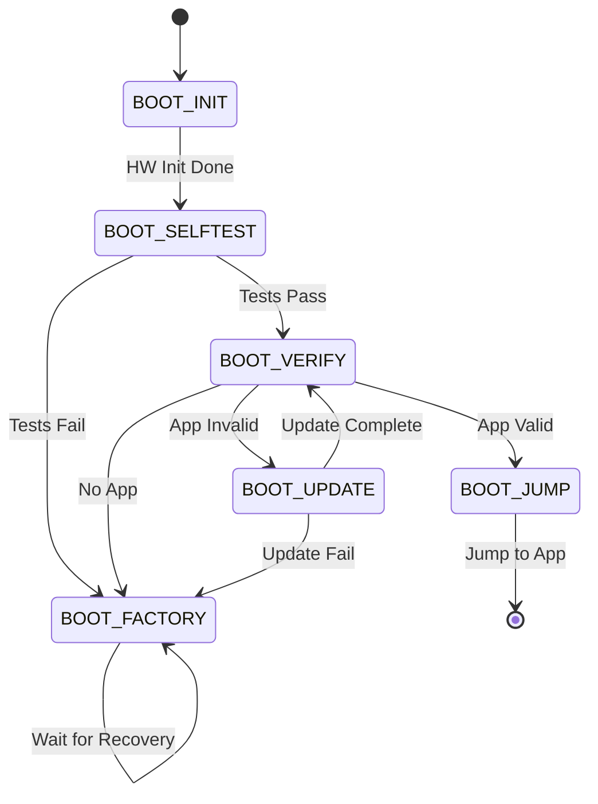

---

## 7. 模块依赖关系

### 7.1 安全模块架构

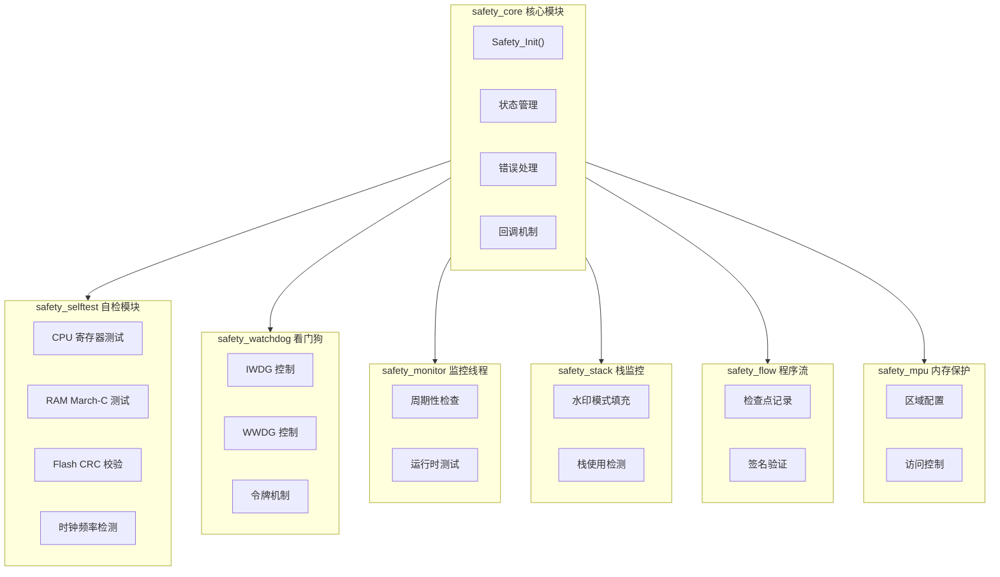

### 7.2 模块依赖 (ASCII)

```
┌─────────────────────────────────────────────────────┐
│                     app_main                        │
└───────────────────────┬─────────────────────────────┘
                        │
                        ▼
┌─────────────────────────────────────────────────────┐
│                    svc_params                       │
└───────────────────────┬─────────────────────────────┘
                        │
                        ▼
┌─────────────────────────────────────────────────────┐
│    safety_core  ◄──── safety_monitor                │
│         │                   │                       │
│         ▼                   ▼                       │
│    safety_mpu         safety_watchdog               │
│                            │                        │
│    safety_flow ◄───────────┘                        │
│         │                                           │
│         ▼                                           │
│    safety_stack       safety_selftest               │
└───────────────────────┬─────────────────────────────┘
                        │
                        ▼
┌─────────────────────────────────────────────────────┐
│                   safety_config                     │
│                        │                            │
│                        ▼                            │
│                   shared_config                     │
└─────────────────────────────────────────────────────┘
```

### 7.3 双看门狗架构

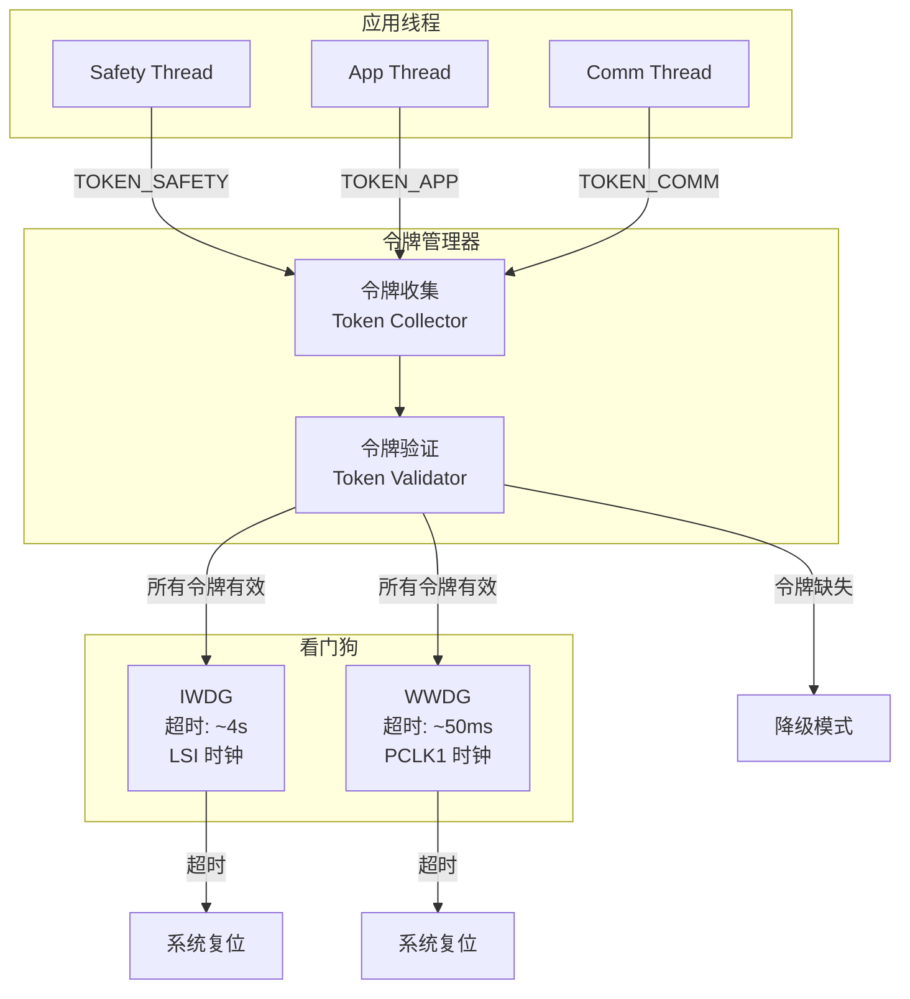

### 7.4 诊断覆盖率

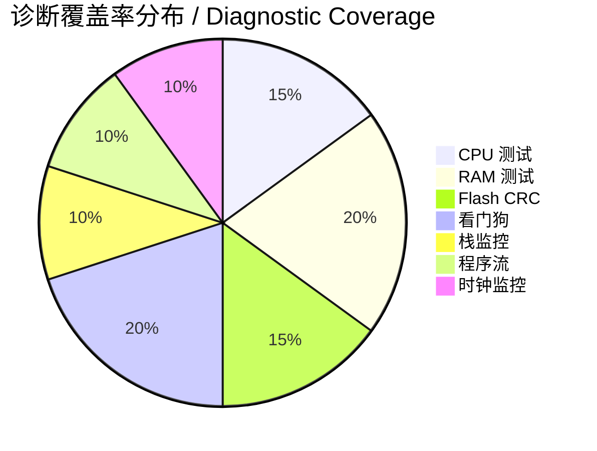

---

## 8. 设计决策

### 8.1 分离 Bootloader 和 Application

**理由**:
- Bootloader 不变性：一旦烧录，通常不更新
- 安全参数独立：在专用 Flash 扇区存储
- 应用升级支持：可单独更新应用程序

### 8.2 基于令牌的看门狗

**理由**:
- 多线程环境下，单一喂狗点不足以验证所有线程正常
- 每个关键线程必须报告令牌，全部收齐才喂狗
- 任一线程卡死都会导致看门狗复位

### 8.3 增量式 Flash CRC

**理由**:
- 全量 CRC 耗时过长，影响实时性
- 每次检查 4KB，5分钟完成全量验证
- 平衡安全性和性能

### 8.4 CCM RAM 存储线程栈

**理由**:
- CCM RAM 仅 CPU 可访问，更安全
- DMA 无法访问 CCM，避免意外覆盖
- 栈溢出不会破坏应用数据

### 8.5 参数冗余存储

**理由**:
- 关键参数存储两份 (原值 + 位反转)
- 单比特翻转可检测
- 符合 IEC 61508 要求

---

## 9. CI/CD 流程

### 9.1 完整 CI/CD 流程

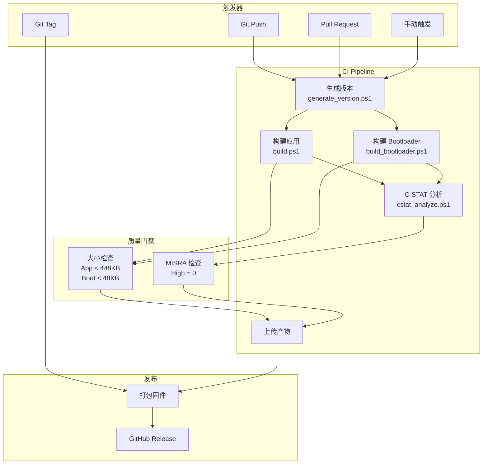

### 9.2 本地开发流程

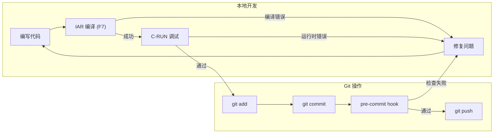

### 9.3 数据流

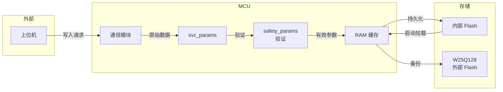

---

## 附录: Mermaid 使用说明

### 查看方式

1. **GitHub** - 直接在 GitHub 仓库中查看，自动渲染
2. **VS Code** - 安装 "Markdown Preview Mermaid Support" 扩展
3. **在线编辑器** - https://mermaid.live/

### 本地预览

```bash
# 安装 mermaid-cli
npm install -g @mermaid-js/mermaid-cli

# 生成 PNG
mmdc -i ARCHITECTURE.md -o output.png

# 生成 SVG
mmdc -i ARCHITECTURE.md -o output.svg -f svg
```

---

## 版本历史

| 版本 | 日期 | 描述 |
|------|------|------|
| 1.0.0 | 2024-12-10 | 初始版本，整合 Mermaid 图表 |

---

*本文档使用 Mermaid.js 绘制，符合 IEC 61508 SIL 2 文档要求*
