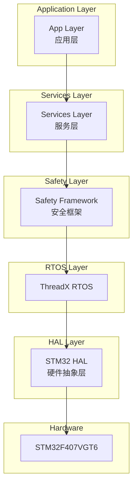
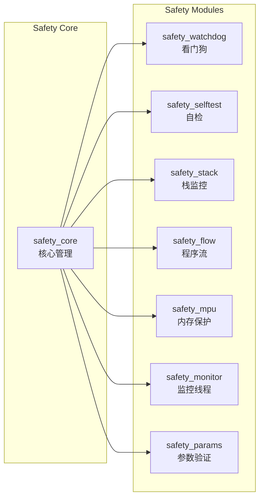
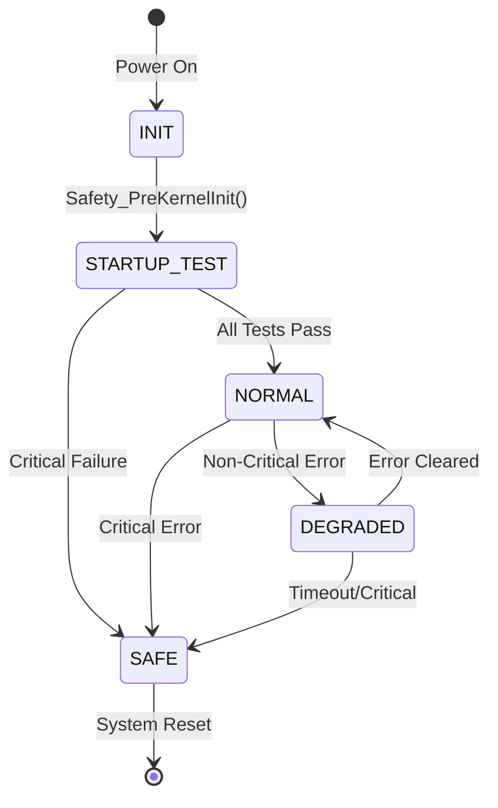
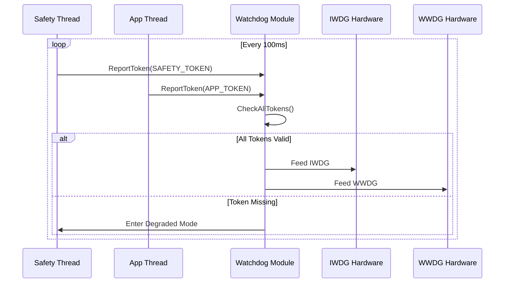

# 功能安全检查清单 / Functional Safety Checklist

**项目 / Project**: TKX_ThreadX
**合规标准 / Compliance**: IEC 61508 SIL 2 / ISO 13849 PL d
**版本 / Version**: 1.0.0

---

## 目录 / Table of Contents

1. [系统架构图 / System Architecture](#1-系统架构图--system-architecture)
2. [设计阶段检查 / Design Phase Checks](#2-设计阶段检查--design-phase-checks)
3. [编码阶段检查 / Coding Phase Checks](#3-编码阶段检查--coding-phase-checks)
4. [测试阶段检查 / Testing Phase Checks](#4-测试阶段检查--testing-phase-checks)
5. [代码审查要点 / Code Review Points](#5-代码审查要点--code-review-points)
6. [MISRA-C 合规 / MISRA-C Compliance](#6-misra-c-合规--misra-c-compliance)
7. [发布检查 / Release Checks](#7-发布检查--release-checks)

---

## 1. 系统架构图 / System Architecture

### 1.1 系统层次结构 / System Layer Structure



### 1.2 安全模块架构 / Safety Module Architecture



### 1.3 安全状态机 / Safety State Machine



### 1.4 看门狗令牌机制 / Watchdog Token Mechanism



---

## 2. 设计阶段检查 / Design Phase Checks

### 2.1 架构设计 / Architecture Design

| 检查项 / Check Item | 要求 / Requirement | 状态 / Status |
|---------------------|---------------------|---------------|
| 分层架构 | 系统使用清晰的分层架构 / Clear layered architecture | ☐ |
| 模块独立性 | 模块间低耦合 / Low coupling between modules | ☐ |
| 错误传播 | 错误不应跨层传播 / Errors should not propagate across layers | ☐ |
| 安全隔离 | 安全功能与非安全功能隔离 / Safety functions isolated | ☐ |
| 内存保护 | 使用 MPU 保护关键区域 / MPU protects critical regions | ☐ |

### 2.2 安全分析 / Safety Analysis

| 检查项 / Check Item | 要求 / Requirement | 状态 / Status |
|---------------------|---------------------|---------------|
| FMEA 分析 | 完成失效模式分析 / Failure mode analysis completed | ☐ |
| 诊断覆盖率 | DC ≥ 90% (运行时) / DC ≥ 90% (runtime) | ☐ |
| 共因失效 | 识别并缓解共因失效 / CCF identified and mitigated | ☐ |
| 安全功能 | 所有安全功能已识别 / All safety functions identified | ☐ |

---

## 3. 编码阶段检查 / Coding Phase Checks

### 3.1 编码规范 / Coding Standards

| 检查项 / Check Item | 要求 / Requirement | 状态 / Status |
|---------------------|---------------------|---------------|
| 命名规范 | 遵循 CODING_STANDARD.md / Follow CODING_STANDARD.md | ☐ |
| Doxygen 注释 | 所有公共函数有文档 / All public functions documented | ☐ |
| 头文件格式 | 使用标准模板 / Use standard template | ☐ |
| 类型安全 | 使用 stdint.h 类型 / Use stdint.h types | ☐ |
| 常量后缀 | 数字常量有 U/UL 后缀 / Constants have U/UL suffix | ☐ |

### 3.2 防御性编程 / Defensive Programming

| 检查项 / Check Item | 要求 / Requirement | 状态 / Status |
|---------------------|---------------------|---------------|
| 输入验证 | 所有外部输入已验证 / All external inputs validated | ☐ |
| 空指针检查 | 检查所有指针参数 / Check all pointer parameters | ☐ |
| 边界检查 | 数组访问有边界检查 / Array access has bounds check | ☐ |
| 返回值检查 | 检查所有函数返回值 / Check all function return values | ☐ |
| 初始化 | 所有变量已初始化 / All variables initialized | ☐ |

### 3.3 安全机制 / Safety Mechanisms

| 检查项 / Check Item | 要求 / Requirement | 状态 / Status |
|---------------------|---------------------|---------------|
| 看门狗喂狗 | 正确报告令牌 / Correctly report tokens | ☐ |
| 栈监控 | 线程已注册栈监控 / Thread registered for stack monitoring | ☐ |
| 程序流 | 使用检查点 / Use flow checkpoints | ☐ |
| 错误处理 | 错误正确报告 / Errors properly reported | ☐ |
| 安全状态 | 可进入安全状态 / Can enter safe state | ☐ |

---

## 4. 测试阶段检查 / Testing Phase Checks

### 4.1 单元测试 / Unit Testing

| 检查项 / Check Item | 要求 / Requirement | 状态 / Status |
|---------------------|---------------------|---------------|
| 测试覆盖率 | 代码覆盖率 ≥ 80% / Code coverage ≥ 80% | ☐ |
| 边界测试 | 测试边界条件 / Boundary conditions tested | ☐ |
| 错误路径 | 测试错误处理路径 / Error paths tested | ☐ |
| Mock 使用 | 硬件依赖已 Mock / Hardware dependencies mocked | ☐ |

### 4.2 集成测试 / Integration Testing

| 检查项 / Check Item | 要求 / Requirement | 状态 / Status |
|---------------------|---------------------|---------------|
| 接口测试 | 模块接口已测试 / Module interfaces tested | ☐ |
| 状态转换 | 状态机转换已验证 / State transitions verified | ☐ |
| 时序测试 | 时序要求已验证 / Timing requirements verified | ☐ |
| 负载测试 | 在负载下测试 / Tested under load | ☐ |

### 4.3 安全测试 / Safety Testing

| 检查项 / Check Item | 要求 / Requirement | 状态 / Status |
|---------------------|---------------------|---------------|
| 故障注入 | 进行故障注入测试 / Fault injection performed | ☐ |
| 看门狗测试 | 看门狗超时已验证 / Watchdog timeout verified | ☐ |
| 自检验证 | 所有自检已验证 / All self-tests verified | ☐ |
| 安全状态测试 | 安全状态可达 / Safe state reachable | ☐ |
| 恢复测试 | 错误恢复已测试 / Error recovery tested | ☐ |

---

## 5. 代码审查要点 / Code Review Points

### 5.1 必查项目 / Mandatory Review Items

```markdown
## 代码审查清单 / Code Review Checklist

### 安全相关 / Safety Related
- [ ] 无动态内存分配 / No dynamic memory allocation
- [ ] 无无限循环无退出 / No infinite loops without exit
- [ ] 所有函数有返回值检查 / All functions have return value checks
- [ ] 关键数据有冗余 / Critical data has redundancy
- [ ] 状态机转换有效性检查 / State machine transition validation

### 代码质量 / Code Quality
- [ ] 符合 CODING_STANDARD.md / Complies with CODING_STANDARD.md
- [ ] 有意义的命名 / Meaningful naming
- [ ] 适当的注释 / Appropriate comments
- [ ] 无魔法数字 / No magic numbers
- [ ] 无代码重复 / No code duplication

### MISRA-C / MISRA-C Compliance
- [ ] 无新增高严重度问题 / No new high severity issues
- [ ] 中严重度问题已评审 / Medium severity reviewed
- [ ] 偏差有文档记录 / Deviations documented
```

### 5.2 审查问题分类 / Review Issue Classification

| 严重度 / Severity | 描述 / Description | 处理 / Action |
|-------------------|---------------------|---------------|
| **Critical** | 安全问题、数据损坏风险 / Safety issue, data corruption risk | 必须修复后合并 / Must fix before merge |
| **Major** | 功能缺陷、MISRA 高违规 / Functional defect, MISRA high violation | 应修复后合并 / Should fix before merge |
| **Minor** | 代码风格、可读性 / Code style, readability | 可在后续修复 / Can fix later |
| **Info** | 建议、优化 / Suggestions, optimizations | 可选修复 / Optional fix |

---

## 6. MISRA-C 合规 / MISRA-C Compliance

### 6.1 C-STAT 分析配置 / C-STAT Analysis Configuration

```
排除路径 / Excluded Paths:
- Middlewares/ST/*        (ThreadX, FileX)
- Drivers/CMSIS/*         (ARM CMSIS)
- ThirdParty/*            (Segger RTT/SystemView)

检查范围 / Check Scope:
- Safety/*                (Safety modules)
- App/*                   (Application)
- Services/*              (Services)
- BSP/*                   (Board Support Package)
- Shared/*                (Shared code)
```

### 6.2 合规目标 / Compliance Targets

| 规则类别 / Rule Category | 目标 / Target |
|--------------------------|---------------|
| Mandatory 规则 | 100% 合规 / 100% compliant |
| Required 规则 | ≥ 95% 合规 / ≥ 95% compliant |
| Advisory 规则 | ≥ 80% 合规 / ≥ 80% compliant |
| 高严重度问题 | 0 个 / 0 issues |
| 中严重度问题 | 有文档记录 / Documented |

---

## 7. 发布检查 / Release Checks

### 7.1 发布前检查清单 / Pre-Release Checklist

| 检查项 / Check Item | 要求 / Requirement | 状态 / Status |
|---------------------|---------------------|---------------|
| CI 构建通过 | 所有 CI 检查通过 / All CI checks passed | ☐ |
| 测试报告 | 所有测试通过 / All tests passed | ☐ |
| C-STAT 报告 | 无高严重度问题 / No high severity issues | ☐ |
| 代码审查 | 所有代码已审查 / All code reviewed | ☐ |
| 文档更新 | 文档与代码同步 / Documentation synced | ☐ |
| 版本号更新 | 版本号已更新 / Version number updated | ☐ |
| 变更日志 | CHANGELOG 已更新 / CHANGELOG updated | ☐ |

### 7.2 发布产物 / Release Artifacts

```
TKX_ThreadX-vX.Y.Z/
├── TKX_ThreadX.hex          # 主应用程序
├── TKX_ThreadX.bin          # 主应用程序（二进制）
├── Bootloader.hex           # Bootloader
├── Bootloader.bin           # Bootloader（二进制）
├── build_info.json          # 构建信息
├── cstat_summary.json       # C-STAT 摘要
├── RELEASE_NOTES.md         # 发布说明
└── test_report.xml          # 测试报告
```

---

## 版本历史 / Version History

| 版本 / Version | 日期 / Date | 描述 / Description |
|----------------|-------------|---------------------|
| 1.0.0 | 2024-12-10 | 初始版本 / Initial version |

---

*本检查清单符合 IEC 61508 SIL 2 / ISO 13849 PL d 要求*
*This checklist complies with IEC 61508 SIL 2 / ISO 13849 PL d requirements*
